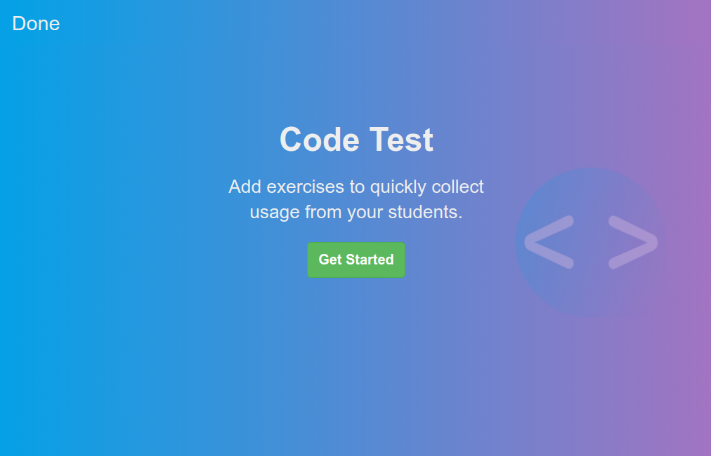

# Teacher View


Once you have created the **external tool activity**  or  and you have displayed it, you will see the welcome page:



Simply, click on **Get Started** button

Teacher Control Center appears:


At the beginning, every counter is **0**:
- exercises
- usage
- grades 

## Creating an exercise

As JuezLTI uses [_YAPExIL_](https://raw.githubusercontent.com/FGPE-Erasmus/format-specifications/master/schemas/yapexil.schema.json) format to store all exercise types, the interface to create exercises is the same for programming, databases or markup languages exercises.

The Image below shows the form to define exercises:


## Examples
Examples below show how to fill the CodeTest form to get a Java or PostgreSQL exercise.

For exercises that need more YAPExIL properties, JuezLTI recommends [Authorkit](https://python.usz.edu.pl/authorkit/ui/dashboard). 
### Java exercise example:
- **Exercise Title**: `Welcome`
- **Keywords**: `Input, Output`
- **Exercise statement**: Write a Java program to print `Hello ` followed by a name received by standard input.

- **Code solution**: 
```
import java.util.Scanner;

public class Main {

    public static void main(String[] args)
    {
        Scanner input = new Scanner (System.in);
        String name = input.next();
        System.out.print("Hello "+name);
    }
}
```

- **Language**: Java

- **With these inputs**: `Charles`

- **Expect these outputs**: `Hello Charles`

- **Add library**: _At the moment it is used only to provide a script with initial data to **test database exercises**_.

Click on **Save Exercise** button and access to Exercises list page. From there, you are able to edit or delete any exercise created with CodeTest.

### PostgreSQL exercise examples:

JuezLTI allows to create DQL, DDL and DML exercises. Next there is an example of DDL exercise:
- **Exercise Title**: `ALTER TABLE: RENAME`
- **Keywords**: `DDL, RENAME TABLE`
- **Exercise statement**: 
```
Imagine that we have created the following table:
    CREATE TABLE SUBJECTS (
        Name VARCHAR(100),
        NumHours INTEGER
    );
Rename the SUBJECTS table to MODULES.
```

- **Code solution**: 
```
ALTER TABLE SUBJECTS RENAME TO MODULES;
```

- **Language**: PostgreSQL

- **With these inputs**: 
```
SELECT table_name, column_name, data_type
FROM information_schema.columns
WHERE lower(table_name) in ('modules', 'subjects') and table_schema = 'public'
ORDER BY column_name;
```

- **Expect these outputs**:
```
 table_name | column_name |     data_type     
------------+-------------+-------------------
 modules    | name        | character varying
 modules    | numhours    | integer
(2 rows)
```

- **Add library**: Click on **+** button and fill with these values:
  - title: `subjects table script`
  - body:
    ```
    CREATE TABLE SUBJECTS (
        Name VARCHAR(100),
        NumHours INTEGER
    );
    ```

Click on **Save Exercise** button and access to Exercises list page. From there, you are able to edit, delete or reorder the exercises created with CodeTest.


Next is an example of DQL exercise:
- **Exercise Title**: `Unconditional SELECT`
- **Keywords**: `DQL, Unconditional`
- **Exercise statement**: 
```
Show all data stored in the table countries.
```
- **Code solution**: 
```
SELECT * FROM countries
```

- **Language**: PostgreSQL

- **With these inputs**:
We don't need any input. Then, a comment is enough
```
-- .
```

- **Expect these outputs**:
```
 country_id | country_name | region_id 
------------+--------------+-----------
 ES         | Spain        | 1
 PT         | Portugal     | 1
 SE         | Sweden       | 1
 TR         | Türkiye      | 1
(4 rows)
```

- **Add library**: Click on **+** button and fill with these values:
  - title: `subjects table script`
  - body:
    ```
    CREATE TABLE countries 
        ( country_id CHAR(2) not null PRIMARY KEY       
        , country_name VARCHAR(40) 
        , region_id INTEGER REFERENCES regions(region_id)
        ); 

    INSERT INTO countries VALUES( 'ES', 'Spain', 1);
    INSERT INTO countries VALUES( 'PT', 'Portugal', 1);
    INSERT INTO countries VALUES( 'SE', 'Sweden', 1);
    INSERT INTO countries VALUES( 'TR', 'Türkiye', 1);
    ```

Click on **Save Exercise** button.
## Importing exercises from Authorkit

JuezLTI team has shared different sets of exercises in [Authorkit](https://python.usz.edu.pl/authorkit/ui/dashboard) to allow instructors using JuezLTI with as little effort as possible:
- [101 Java exercises](https://python.usz.edu.pl/authorkit/ui/projects/7f1dc980-a4ed-4c94-9488-e3db1f36c7e1/exercises)
- PostgreSQL exercises
  - [58 DQL exercises](https://python.usz.edu.pl/authorkit/ui/projects/3b71a2f0-e295-4a95-988d-bd6aa9b73ca8/exercises)
  - [22 DDL exercises](https://python.usz.edu.pl/authorkit/ui/projects/4f0281e5-2543-49a9-b0e5-83324553a579/exercises)
  - [16 DML exercises](https://python.usz.edu.pl/authorkit/ui/projects/83a38e8c-e4c4-45d3-b1a6-ec7509c433d5/exercises)

Every authorkit exercise could be imported into JuezLTI. Simply, access to _Import from Authorkit_ action in _Exercises_ menu or panel.

When _Import from Authorkit_ action is selected a folated windows appears and shows the groups of exercises labeled as public.

JuezLTI suggests starting with groups of exercises that have been already tested:
- JuezLTI Programming
- MOOC exercises DB: DQL
- MOOC exercises DB: DDL
- MOOC exercises DB: DML

Click on a desired group and then choose the exercise you want to import.


Accessing to _Exercises list_ you can see that the exercises has been imported, although Authorkit imported exercises are not able to edit.


