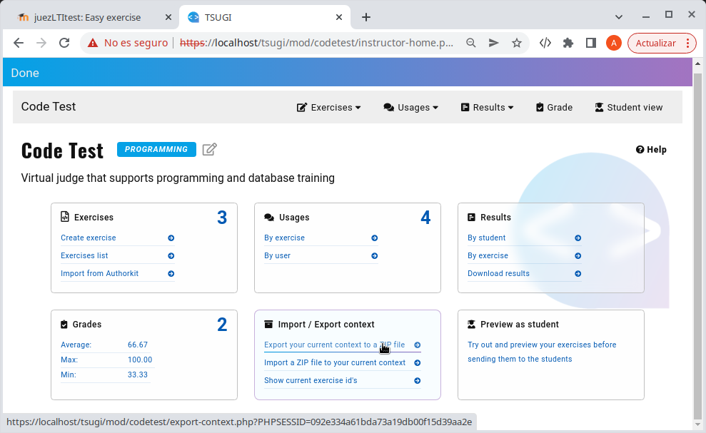
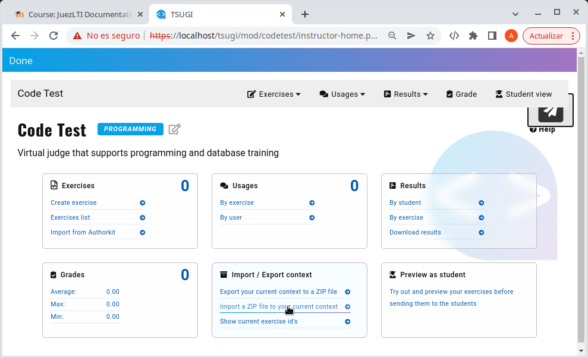
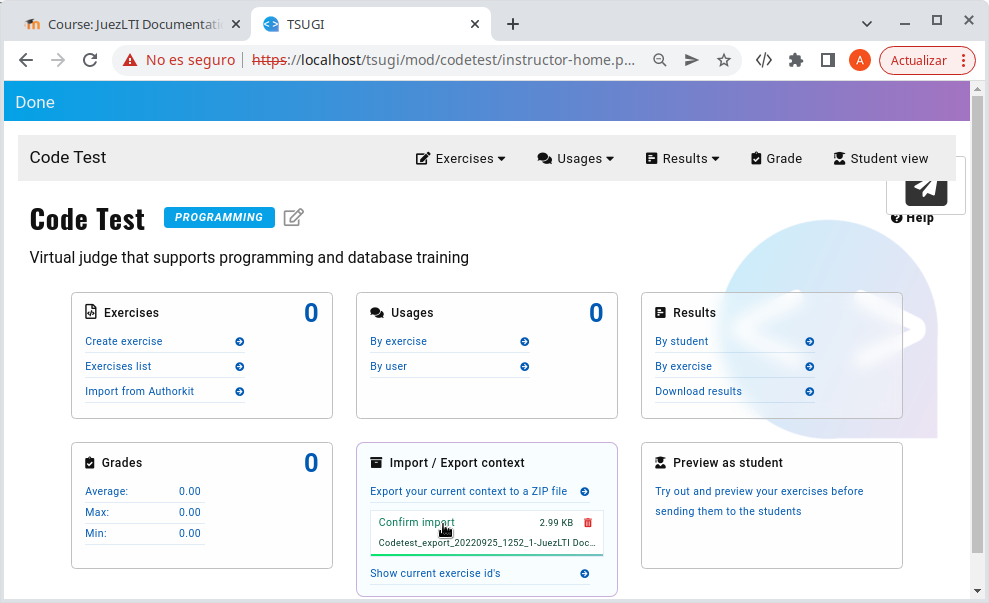

# Copia de seguridad y restauración

Los docentes pueden exportar el contexto (actividad) con los ejercicios de los que está compuesto, para importarlos posteriormente en una actividad diferente o en otro LMS.

Los pasos para hacerlo serían los siguientes:

1. Exportar el contexto a un archivo zip, seleccionando la opción mostrada en la imagen siguiente.

1. Crear una nueva actividad en el LMS como se explicó en el capítulo _[Utilizando JuezLTI en Moodle](usingInMoodle.md)_.
2. Abre la actividad y accede a la _Vista de Profesor_
3. Importa el archivo zip, que fue descargado previamente, en el contexto actual.

5. Confirma la importación.

Al finalizar, podrás ver como el número de ejercicios ha cambiado y se ha incrementado en el número de ejercicios pertenecientes al contexto original. 
