# Obtener Credenciales
Para asegurar los mensajes intercambiados entre el LMS y JuezLTI se utiliza el protocolo OAuth. OAuth exige una **key** y un **secret** compartido para firmar los mensajes. La **key** es transmitida con cada mensaje, así como una firma generada por OAuth basada en dicha **key**. JuezLTI busca el secreto en función de la clave proporcionada y vuelve a calcular la firma y compara la firma recalculada con la firma transmitida para verificar las credenciales del remitente.

El procedimiento para obtener la **key** y el **secret** es el siguiente:
  - [Autenticación en JuezLTI](#autenticación-en-juezlti)
  - [Solicitud key/secret](#solicitud-keysecret)
  - [Autorización por el admin de JuezLTI](#autorización-por-el-admin-de-juezlti)
  - [Envío de key/secret](#envío-de-keysecret)

Estos pasos se muestran en la siguiente imagen:
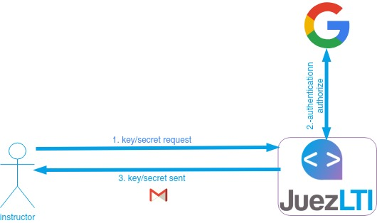

## Autenticación en JuezLTI

JuezLTI usa [Tsugi](https://www.tsugi.org) para gestionar las peticiones de **key/secret** y Tsugi exige autenticación con una cuenta de gestionada por Google. Por lo tanto, accede a la [página de Tsugi en JuezLTI](https://beta.juezlti.eu/tsugi/) y pulsa sobre _Login_ como se muestra en la imagen:
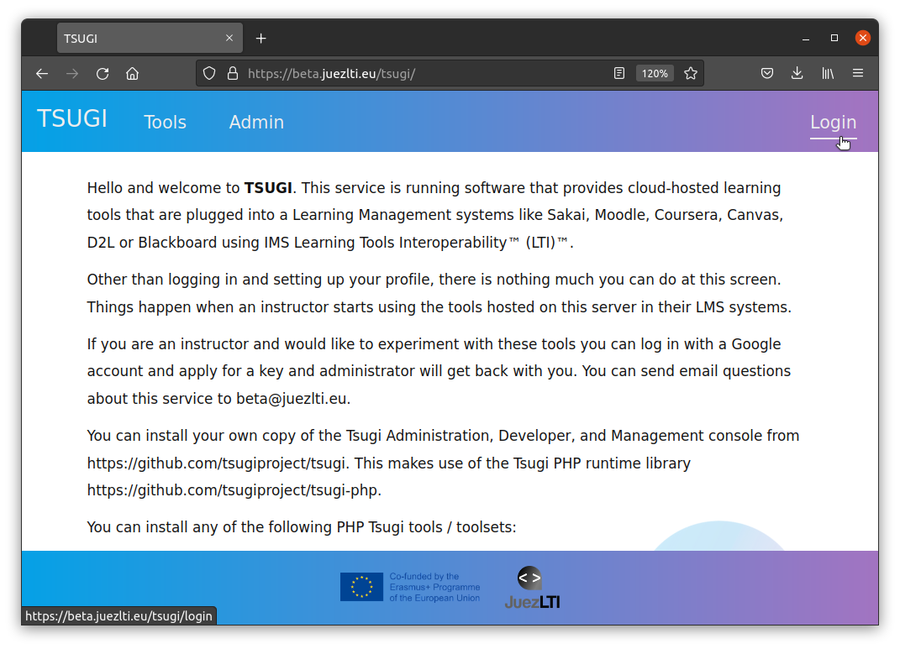
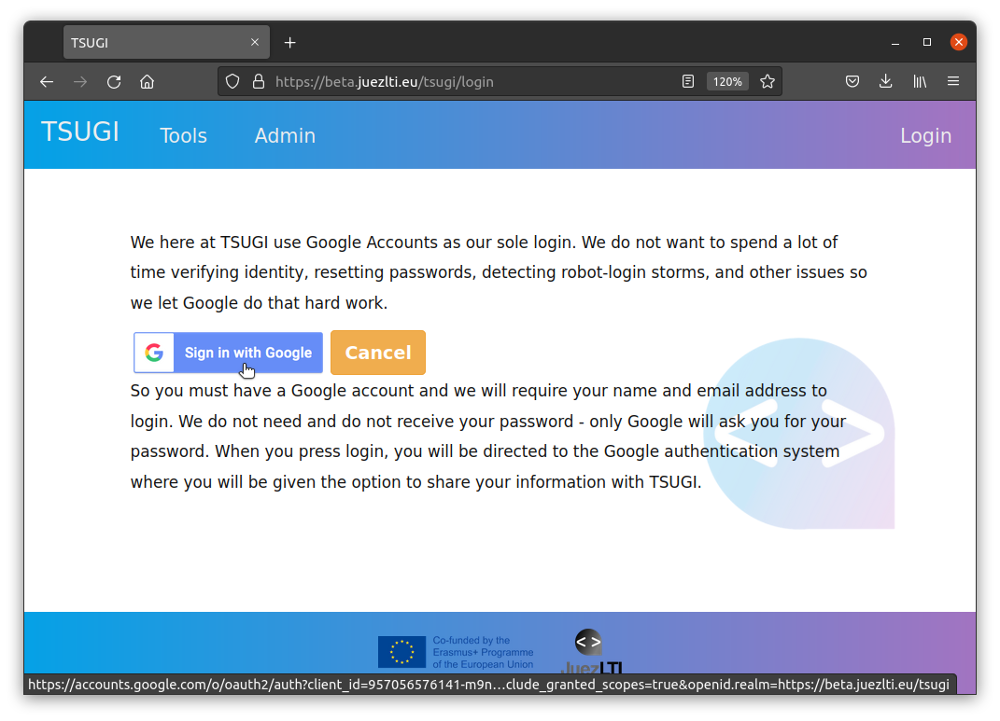

La cuenta de Google facilitada será la que reciba las credenciales **key/secret**.

Tras la autenticación con la cuenta de Google, se mostrará una página para la configuración del perfil en la que se podrá definirlo y guardarlo pulsando en el botón **Save** o **Save Profile Data**:
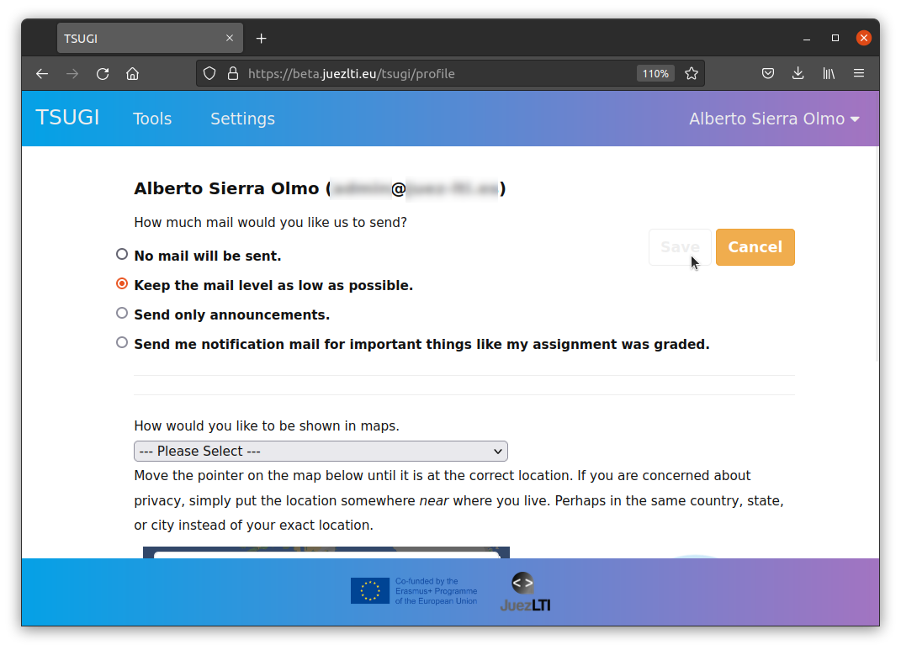

## Solicitud key/secret

Una vez autenticado, pulsa en **Configuraciones** 
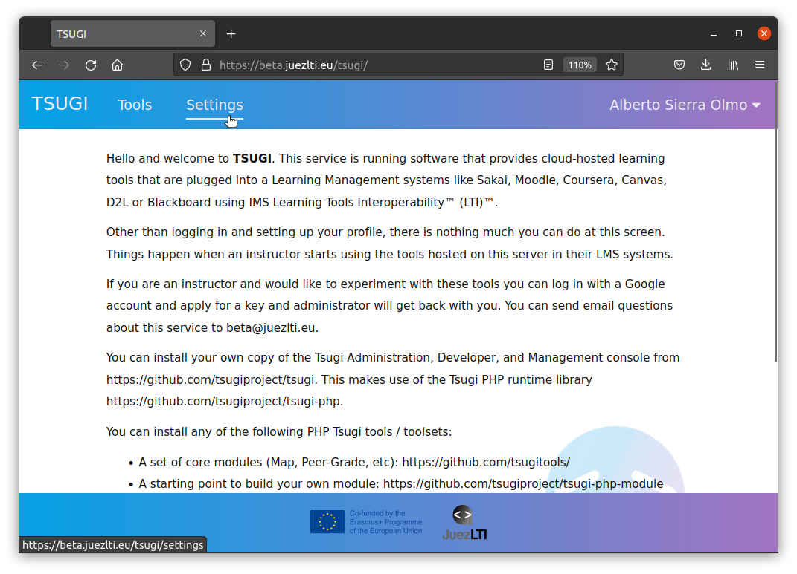

Si es la primera solicitud de credenciales, verás un (0) al lado del item **Manage LMS Access Keys**. Pulsa sobre **Manage LMS Access Keys**
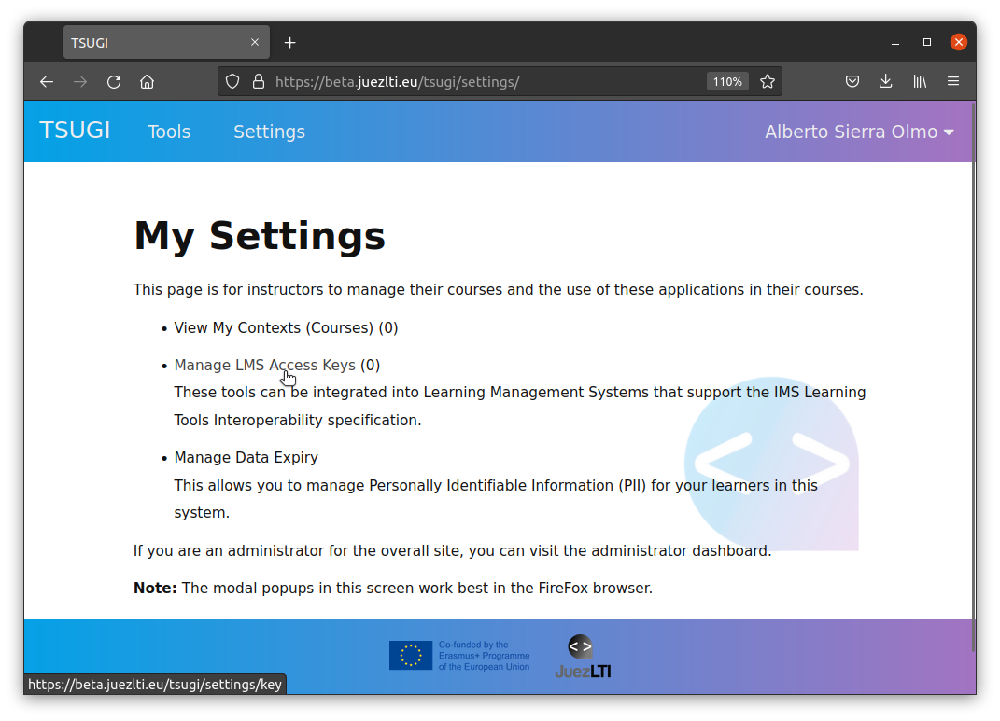
Aparecerá seleccionado el botón **LTI Keys** y el mensaje _"You have no IMS LTI Keys for this system."_.

Pulsa sobre el botón **Key Request**
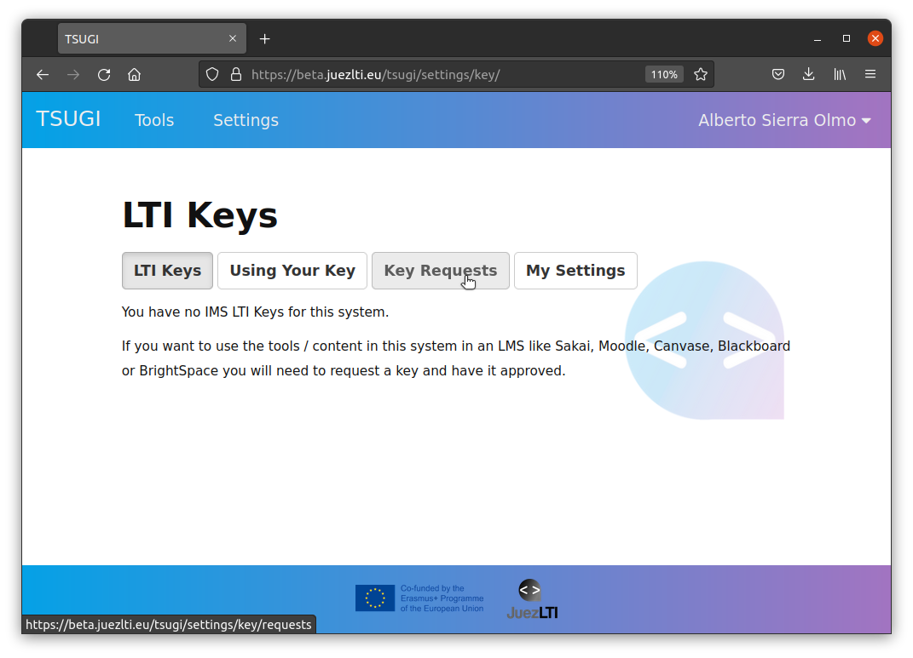

Y, posteriormente, sobre **New Key Request**
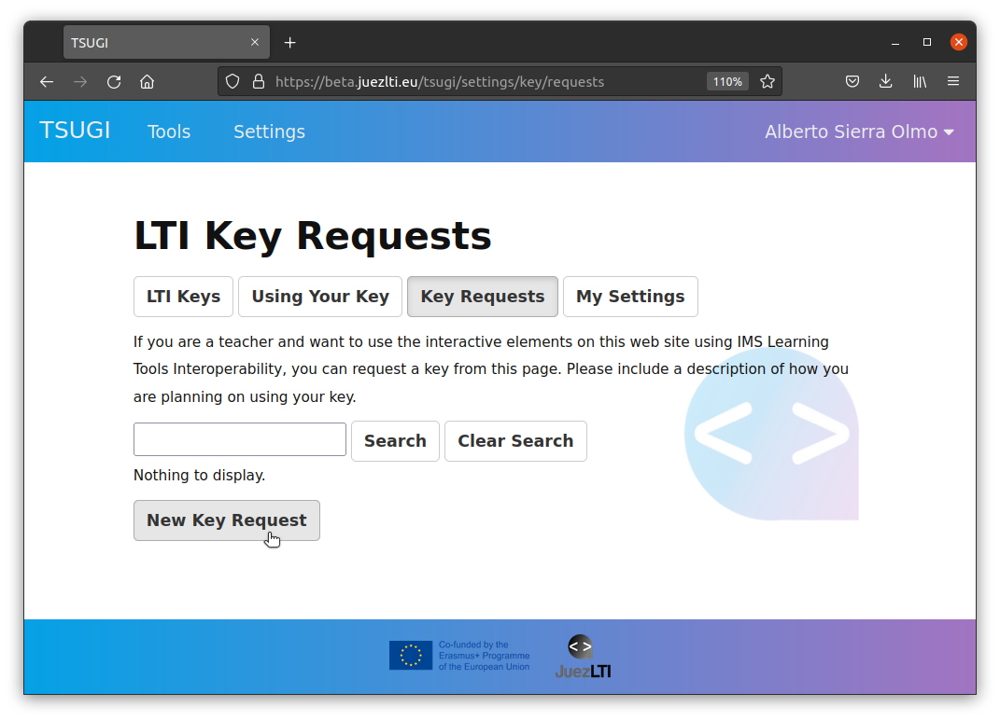

Rellena el formulario y explica el motivo por el que vas a utilizar las credenciales o dónde las vas a utilizar, por favor.
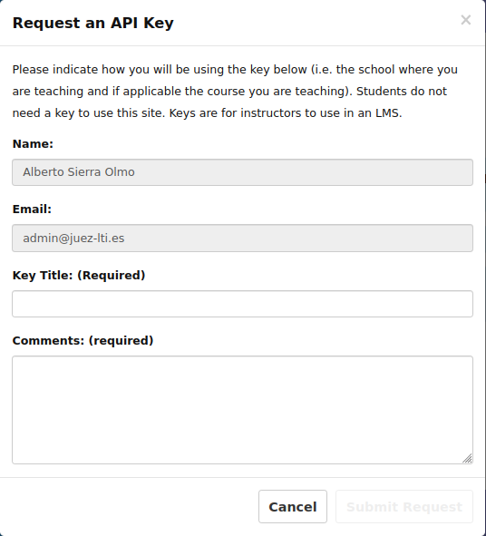

Con ello, se habrá solicitado una nueva **key**, que aparecerá con el estado (**Waiting**).
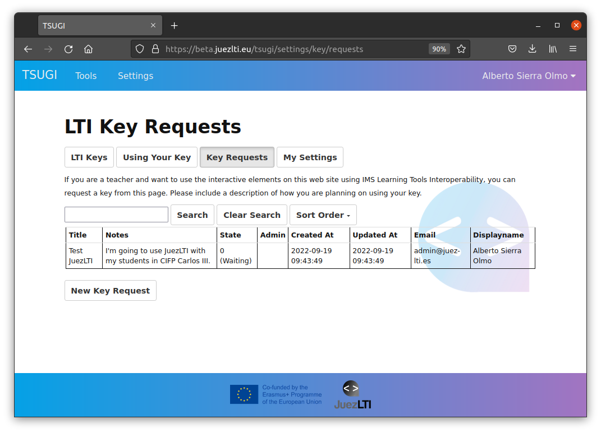

## Autorización por el admin de JuezLTI

Con la solicitud, se enviará un email al personal de JuezLTI que aprobará la solicitud tan pronto como les sea posible. Tras la aprobación, recibirá un email de confirmación en la cuenta de Google utilizada.

## Envío de key/secret

Tras la aprobación, usted podrá volver a autenticarse (_login_) y ver la **key** aprobada en la sección **LTI Keys**.
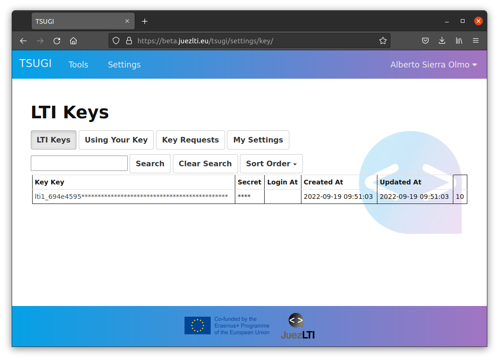
