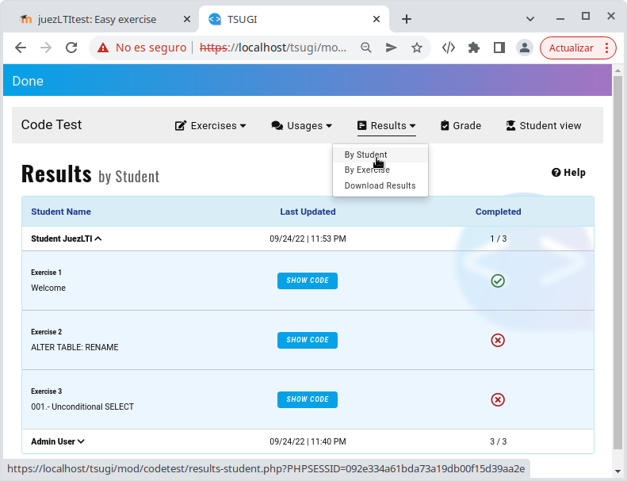
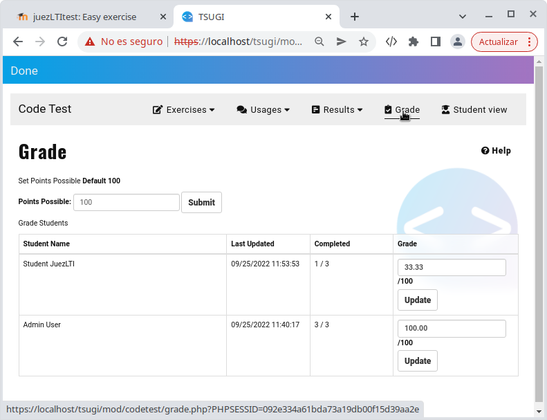
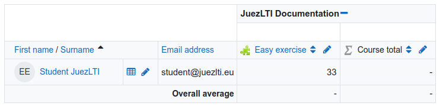
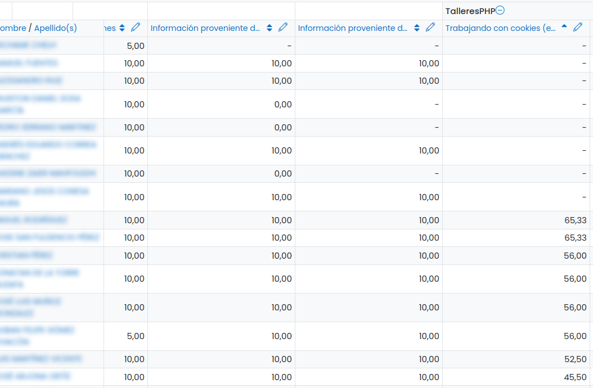

# Revisión de los resultados

Los profesores tienen dos lugares wn los que pueden revisar los resultados de sus estudiantes:

  - [Revisión de los resultados en la vista profesor](#reviewing-results-in-teacher-view)
  - [Revisión de los resultados en el calificador del LMS](#reviewing-results-in-grade-lms)

## Revisión de los resultados en la vista profesor

Los profesores pueden seguir la actividad de sus estudiantes en el menú _Resultados_.

A continuación, se muestra la lista de ejercicios reueltos por el _Student JuezLTI_:

Como se puede ver, este estudiante ha resuelto solo uno de los tres ejercicios propuestos en la actividad y, pulsando sobre el botón _MOSTRAR CÓDIGO_ el docente puede ver sus respuestas.

También, en el menú _Puntuaciones_ podría ver la calificación obtenida por el estudiante.

La siguiente imagen muestra que la calificación obtenida por _Student JuezLTI_ en la actividad es del 33.33%.

JuezLTI permite que los docentes modifiquen la calificación de cualquiera de los estudiantes , cambiando el valor in el cuadro de texto y pulsando sobre el botón _Actualizar_.

## Revisión de los resultados en el calificador del LMS

Recuerda que la calificación obtenida en JuezLTI es enviada al LMS usando el estándar LTI. Por lo tanto, la misma calificación que el docente puede ver en JuezLTI puede también ser visto en el LMS.

En el siguiente escenario real, el docente permite que los estudiantes avancen a diferentes velocidades y puede ver las actividades en las que los estudiantes encuentran mayores dificultades y quién necesita más ayuda.

## Descargar los resultados

Una hoja de cálculo con los resultados de los estudiantes está disponible para la descarga.
