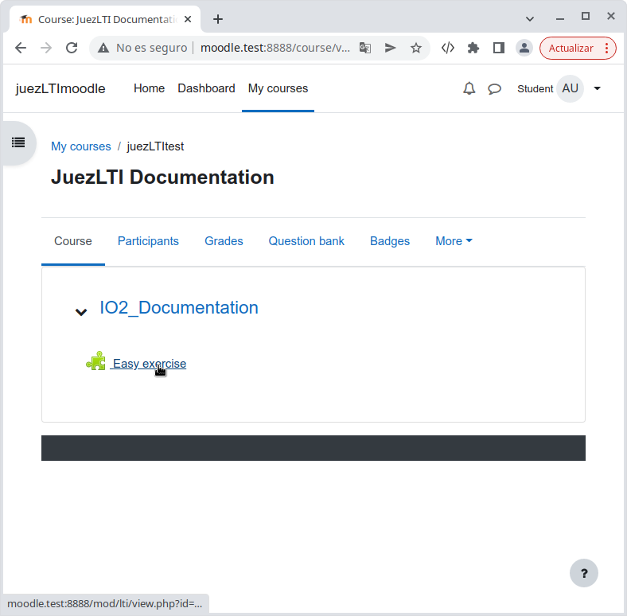
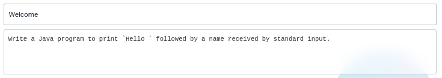

# Vista de estudiante


Una vez que los docentes han creado la **actividad de Herramienta externa**  o , los estudiantes podrían verlo en su página del curso:



El estudiante solo necesita pulsar en la Actividad Externa, en este caso _Easy exercise_

Aparecerá una vista similar a la que se muestra a continuación:


En la parte superior de la página, se muestra la lista de ejercicios que componen la actividad:


El ejemplo superior muestra una actividad compuesta por tres ejercicios, cada uno en uno de los tres estados posibles:

- _naranja_: el estudiante no respondió el ejercicio.
- _verde_: el estudiante resolvió el ejercicio.
- _rojo_: el estudiante envió una respuesta errónea al ejercicio.

El estudiante puede utilizar la lista de ejercicios para navegar a través de los ejercicios, pulsando sobre cada uno de ellos.

Tras la lista de ejercicios, aparece el título y el enunciado del ejercicio seleccionado



y el conjunto de los tests


En esos tests, el estudiante puede ver la salida que corresponde con cada una de las entradas. En el siguiente ejemplo, si el código recibe `Charles` debería devolver `Hello Charles`.

El estudiante debe codificar su solución en el apartado _Solución del código_, seleccionando previamente con qué validador (lenguaje) ha desarrollado la solución:


En la parte inferior de la página, el estudiante recibirá la calificación y el _feedback_ a su respuesta.

Debajo, se muestra el resultado de dos códigos diferentes:

- Respuesta incorrecta:

```
import java.util.Scanner;

public class Main {

    public static void main(String[] args)
    {
        Scanner input = new Scanner (System.in);
        String name = input.next();
        System.out.print("Hello "+name+"!!");
    }
}
```


- Respuesta correcta:

```
import java.util.Scanner;

public class Main {

    public static void main(String[] args)
    {
        Scanner input = new Scanner (System.in);
        String name = input.next();
        System.out.print("Hello "+name);
    }
}
```

