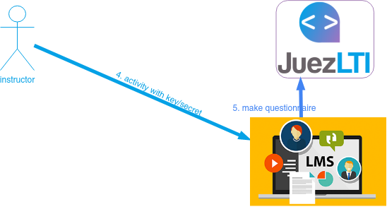
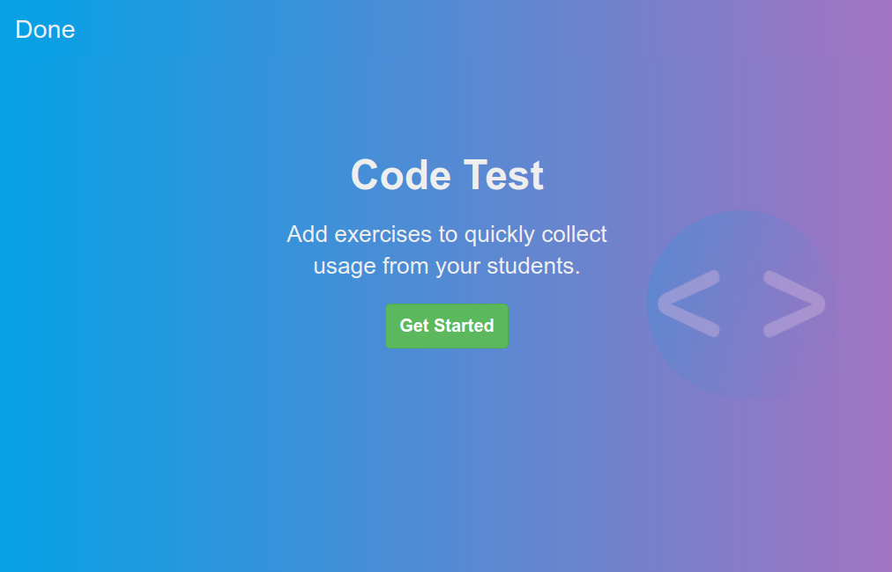
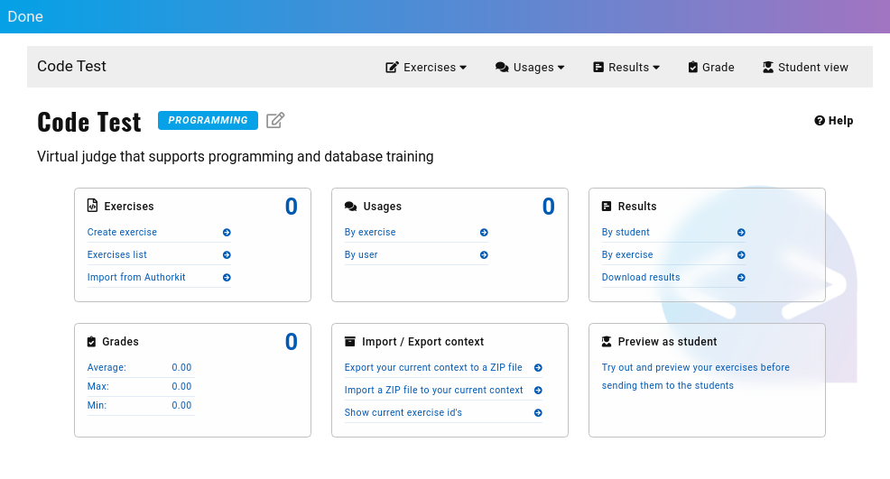
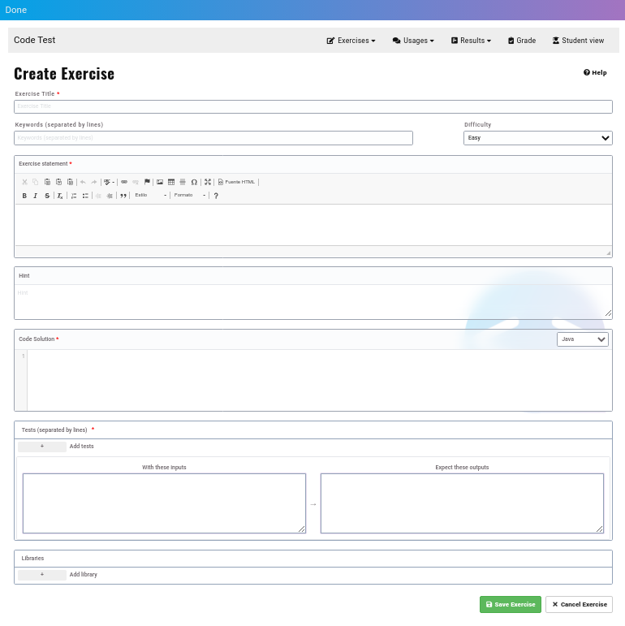
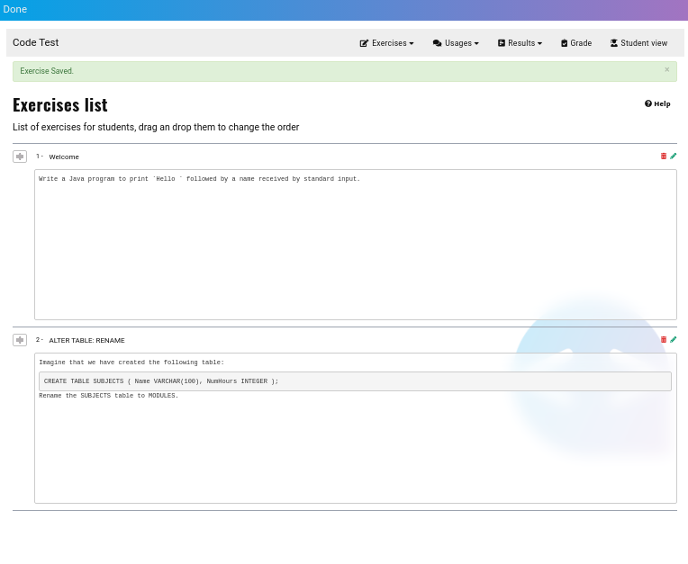
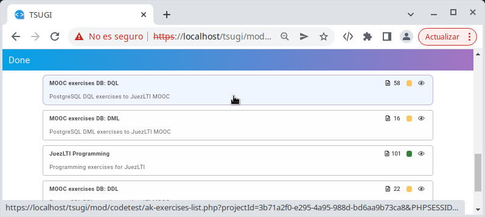
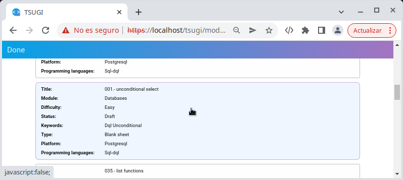
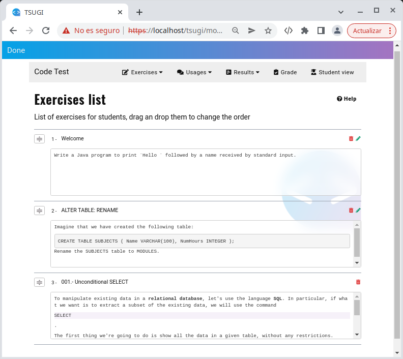

# Vista del profesor



Una vez creada la **actividad de herramienta externa**  o  y se ha accedido a ella como instructor, se muestra la página de bienvenida:



Simplemente, pulsaremos sobre el botón **Get Started**.

Aparecerá el Centro de control del profesor:


Al inicio, cada contador está a **0**:
- ejercicios
- opiniones
- puntuaciones

## Creando un ejercicio

Como JuezLTI utiliza [_YAPExIL_](https://raw.githubusercontent.com/FGPE-Erasmus/format-specifications/master/schemas/yapexil.schema.json) como formato para almacenar todos los tipos de ejercicios, la interfaz para crear los ejercicios es la misma para cualquiera de los ejercicios, independientemente de su tipo: programación, bases de datos o lenguajes de marcas.

La siguiente imagen muestra el formulario para definir los ejercicios:


## Ejemplos
Los siguientes ejemplos muestra cómo rellenar el formulario CodeTest para obtener un ejercicio de Java o PostgreSQL.

Para ejercicios en los que se necesita la definición de más propiedades de YAPExIL, JuezLTI recomienda [Authorkit](https://python.usz.edu.pl/authorkit/ui/dashboard).

### Ejemplo de ejercicio Java:

- **Título de la pregunta**: `Welcome`
- **Etiquetas**: `Input, Output`
- **Enunciado**: Escribe un programa Java que escriba `Hello ` seguida por el nombre recibido desde la entrada estándar.

- **Solución del código**: 
```
import java.util.Scanner;

public class Main {

    public static void main(String[] args)
    {
        Scanner input = new Scanner (System.in);
        String name = input.next();
        System.out.print("Hello "+name);
    }
}
```

- **Lenguaje**: Java

- **Con las siguientes entradas**: `Charles`

- **Se espera obtener esta salida**: `Hello Charles`

- **Añadir librería**: _Actualmente, únicamente se utiliza para proveer un script con los datos iniciales en **test de ejercicios de bases de datos**_.

Pulsa sobre el botón **Guardar pregunta** y accederá a la página con el listado de ejercicios. Desde ahí, el profesor podrá edita o borrar cualquier ejercicio creado con CodeTest.

### Ejemplo de ejercicio PostgreSQL:

JuezLTI permite crear ejercicios DQL, DDL y DML. El siguiente en un ejemplo de ejercicio DDL:

- **Título de la pregunta**: `ALTER TABLE: RENAME`
- **Etiquetas**: `DDL, RENAME TABLE`
- **Enunciado**: 
```
Imagina que hemos creado la siguiente tabla:
    CREATE TABLE SUBJECTS (
        Name VARCHAR(100),
        NumHours INTEGER
    );
Renombra la tabla SUBJECTS como MODULES.
```

- **Solución del código**: 
```
ALTER TABLE SUBJECTS RENAME TO MODULES;
```

- **Lenguaje**: PostgreSQL

- **Con las siguientes entradas**: 
```
SELECT table_name, column_name, data_type
FROM information_schema.columns
WHERE lower(table_name) in ('modules', 'subjects') and table_schema = 'public'
ORDER BY column_name;
```

- **Se espera obtener esta salida**:
```
 table_name | column_name |     data_type     
------------+-------------+-------------------
 modules    | name        | character varying
 modules    | numhours    | integer
(2 rows)
```

- **Añadir librería**: Pulsa en el botón **+** y rellénalo con los siguientes datos:
  - title: `subjects table script`
  - body:
    ```
    CREATE TABLE SUBJECTS (
        Name VARCHAR(100),
        NumHours INTEGER
    );
    ```

Pulsa sobre el botón **Guardar pregunta** y accederá a la página con el listado de ejercicios. Desde ahí, el profesor podrá edita o borrar cualquier ejercicio creado con CodeTest.


El siguiente en un ejemplo de ejercicio DQL:
- **Título de la pregunta**: `Unconditional SELECT`
- **Etiquetas**: `DQL, Unconditional`
- **Enunciado**:
- 
```
Muestra todos los datos almacenados en la tabla countries.
```
- **Solución del código**: 
```
SELECT * FROM countries
```

- **Lenguaje**: PostgreSQL

- **Con las siguientes entradas**:
No necesitamos ninguna entrada; con un comentario es suficiente
```
-- .
```

- **Se espera obtener esta salida**:
```
 country_id | country_name | region_id 
------------+--------------+-----------
 ES         | Spain        | 1
 PT         | Portugal     | 1
 SE         | Sweden       | 1
 TR         | Türkiye      | 1
(4 rows)
```

- **Añadir librería**:  Pulsa en el botón **+** y rellénalo con los siguientes datos:
  - title: `subjects table script`
  - body:
    ```
    CREATE TABLE countries 
        ( country_id CHAR(2) not null PRIMARY KEY       
        , country_name VARCHAR(40) 
        , region_id INTEGER REFERENCES regions(region_id)
        ); 

    INSERT INTO countries VALUES( 'ES', 'Spain', 1);
    INSERT INTO countries VALUES( 'PT', 'Portugal', 1);
    INSERT INTO countries VALUES( 'SE', 'Sweden', 1);
    INSERT INTO countries VALUES( 'TR', 'Türkiye', 1);
    ```

Pulsa sobre el botón **Guardar pregunta**.

## Importando ejercicios desde Authorkit

El equipo de JuezLTI ha compartido diferentes conjuntos de ejercicios en [Authorkit](https://python.usz.edu.pl/authorkit/ui/dashboard) para permitir a los docentes el uso de JuezLTI con el menor esfuerzo posible:
- [101 ejercicios de Java](https://python.usz.edu.pl/authorkit/ui/projects/7f1dc980-a4ed-4c94-9488-e3db1f36c7e1/exercises)
- Ejercicios de PostgreSQL
  - [58 ejercicios de DQL](https://python.usz.edu.pl/authorkit/ui/projects/3b71a2f0-e295-4a95-988d-bd6aa9b73ca8/exercises)
  - [22 ejercicios de DDL](https://python.usz.edu.pl/authorkit/ui/projects/4f0281e5-2543-49a9-b0e5-83324553a579/exercises)
  - [16 ejercicios de DML](https://python.usz.edu.pl/authorkit/ui/projects/83a38e8c-e4c4-45d3-b1a6-ec7509c433d5/exercises)

Cada ejercicio de authorkit puede ser importado en JuezLTI. Simplemente, accede a la acción _Importar desde AuthorKit_ en el menú _Ejercicios_ o en su panel.

Cuando se selecciona la acción _Importar desde AuthorKit_ aparecerá una ventana flotante y muestra los grupos de ejercicios etiquetados como público.

JuezLTI sugiere empezar con grupos de ejercicios que hayan sido ya testeados:
- JuezLTI Programming
- MOOC exercises DB: DQL
- MOOC exercises DB: DDL
- MOOC exercises DB: DML

Pulse sobre el grupo seleccionado y elija el ejercicio que desea importar.



Accediendo a _Lista de ejercicios_ podrá comprobar que el ejercicio ha sido importado, aunque los ejercicios importados desde Authorkit no son editables.

