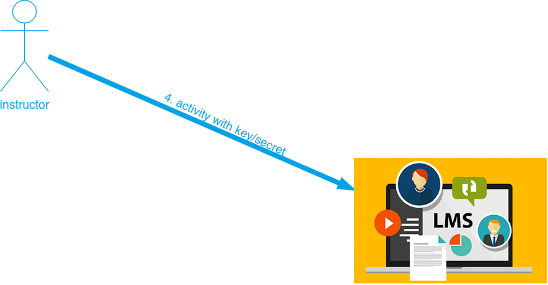

# Utilizando JuezLTI en Moodle

A partir de Moodle 2.2, la **Herramienta externa** permite que los usuarios interactúen con recursos y actividades de aprendizaje que cumplan con el estándar LTI en otros sitios web. Entonces, las **actividades de herramienta externa** son la forma correcta de utilizar JuezLTI desde Moodle.

A continuación, se muestra un resumen de la documentación oficial de Moodle sobre las [Herramienta externa](https://docs.moodle.org/400/en/External_tool).

Dependiendo de sus privilegios in el Moodle de la institución, podrá configurar la herramienta LTI a nivel de actividad o a nivel de la administración del sitio.

## Nivel de actividad

Una vez seleccionada la **actividad de herramienta externa**  o  tendrá que rellenar el siguiente formulario:

- **Nombre de la actividad** -  Añada un título, una descripción si se considera necesaria, junto con la opción de visualización.
- **Herramienta preconfigurada** - este es el modo cómo Moodle se comunica con el proveedor del servicio (JuezLTI). En caso de duda, deje los valores por defecto. Si su administrador ha configurado una herramienta disponible para su sitio Moodle, podrá seleccionarla desde aquí:

- **URL de herramienta segura** - Esta es la URL para conectar con JuezLTI. Si el sitio Moodle usa [SSL](https://en.wikipedia.org/wiki/Transport_Layer_Security) (debe estar sobre [HTTPS](https://docs.moodle.org/400/en/HTTPS)) únicamente podrá utilizar una herramienta que también utilice [SSL](https://en.wikipedia.org/wiki/Transport_Layer_Security). Asegúrese que la URL de la herramienta tenga [HTTPS](https://docs.moodle.org/400/en/HTTPS) antes de intentar utilizarla o podrá recibir una página en blanco.

    En la beta de JuezLTI la URL que se debe utilizar es [https://beta.juezlti.eu/tsugi/mod/codetest/](https://beta.juezlti.eu/tsugi/mod/codetest/). _No olvide la / final_.

- **Iniciar el contenedor** - Indica cómo se visualizará la herramienta externa.
    - Por defecto - opción elegible en caso de duda
    - Incrustado - se muestra en la ventana de Moodle, de forma similar al resto de actividades.
    - Incrustado sin bloquess - se muestra en la ventana de Moodle, mostrando sólo los controles de navegación al principio de la página.
    - Nueva ventana - se muestra en ventana nueva usando todo el espacio disponible.(Dependiendo del navegador se abrirá en nueva pestaña o en ventana emergente. Es posible que algunos navegadores o programas bloqueen la apertura en nueva ventana).

_Las siguientes opciones se muestran pulsando ""Mostrar más":_
- **Descripción de la actividad** - facilitar una breve descripción de la actividad.
- **Muestra la descripción en la página del curso** - la descripción anterior se muestra bajo el enlace de la actividad en el curso.
- **Nombre para mostrar la actividad cuando se inicia** - el nombre se mostrará encima del contenido de JuezLTI.
- **Mostrar la descripción de la actividad cuando se inicia** - la descripción se mostrará encima del contenido de JuezLTI.
- **URL de herramienta segura** - Moodle utilizará la URL segura de la herramienta en lugar de la URL de la herramienta si se accede al sitio de Moodle a través de SSL, o si la configuración de la herramienta está configurada para que siempre se inicie a través de [SSL](https://en.wikipedia.org/wiki/Transport_Layer_Security) (si su sitio está configurado para utilizar [HTTPS](https://docs.moodle.org/400/en/HTTPS))
- **<u>Clave de cliente</u>** - aquí es donde se debe colocar la [**key** facilitada desde JuezLTI](gettingCredentials.md).
- **<u>Secreto compartido</u>** - y aquí el **secret**.
- **Parámetros personalizados** - la mayoría de las veces, este parámetro se dejará vacío. El proveedor de la herramienta podría usarlo para permitir mostrar un recurso específico.
- **URL de icono** - En vez del icono LTI se puede especificar un icono adecuado al tipo de actividad.
- **URL de icono seguro** - se utiliza para evitar que el navegador muestre una advertencia sobre una imagen insegura cuando se accede a través de [SSL](https://en.wikipedia.org/wiki/Transport_Layer_Security).

## Privacidad

- **Compartir el nombre del usuario con la herramienta** - la herramienta puede necesitar el nombre de la persona que la lanza para mostrar información de utilidad dentro de la propia herramienta [como en este ejemplo](https://docs.moodle.org/400/en/images_en/1/13/demoexternaltool.png)
- **Compartir el e-mail del usuario con la herramienta** - especifica si la dirección de correo electrónico del usuario que inicia la herramienta se compartirá con el proveedor de la herramienta. [como en este ejemplo](https://docs.moodle.org/400/en/images_en/2/27/externaltoolfrontpage.png)
- **Aceptar calificaciones desde la herramienta** - JuezLTI admite la opción de notificar las calificaciones a Moodle en función de las acciones realizadas en la herramienta. Consulte [Utilizando herramientas externas](https://docs.moodle.org/400/en/Using_External_tool) para más información.

## Configuración a nivel del sitio

### Añadiendo una herramienta a nivel de sitio

Un administrador puede configurar manualmente herramientas externas en _Administración del sitio > Extensiones > Módulos de Actividad > Herramienta Externa > Administrar herramientas_ para que estén disponibles en todo el sitio.

Una herramienta puede ser configurada por un administrador para que se muestre en el selector de actividad (además de como actividad de herramienta externa) para que un docente lo pueda añadir a un curso. Su descripción, si alguna está presente, aparecerá en el selector de actividad.

### Viendo más detalles

En la página de _'Administrar herramientas'_ puede visitar también _'Gestionar herramientas preconfiguradas'_ para ver las herramientas preconfiguradas en un formato tabular.

Hay pestañas para añadir una herramienta externa, para ver aquellas que están pendientes y para ver aquellas que han sido rechazadas:

Visitando _'Administrar registros de la herramienta externa'_ se puede ver las herramientas registradas en un formato tabular o añadir un registro externo con capacidades limitadas.

Para añadir una herramienta con capacidades limitadas.
1. Pulse sobre 'Configurar una nueva herramienta externa de registro'

2. Configure los detalles en la página de opciones:

_'Miembros'_, permite que la herramienta externa solicite una lista de usuarios con un cierto rol en un contexto específico. Por ejemplo, los usuarios matriculados en un curso.

3. Pulse sobre la casilla de verificación para registrarlo:

1. Tras obtener el mensaje de éxito, pulse para completar el proceso:

1. Si se cumplen todos los requisitos, se podrá registrar automáticamente.

2. Ahora, puede acceder a __Administración del sitio > Extensiones > Módulos de Actividad > Herramienta Externa > Administrar herramientas > Administrar registros de la herramienta externa_ y pulse sobre la pestaña 'Pendientes'

3. Pulse sobre la casilla de verificación para activarlo:

Observe la captura de pantalla [Registro de la herramienta externa](http://www.spvsoftwareproducts.com/temp/lti2-moodle/) para una demostración de los pasos mencionados.
