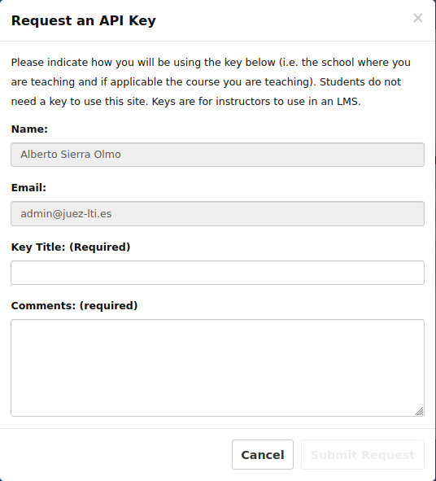

# Obtenção de credenciais
Para assegurar as interacções de mensagens entre o LMS e o JuezLTI, é utilizado o protocolo OAuth. A assinatura OAuth requer uma **chave** e um **segredo** partilhado para assinar mensagens. A chave é transmitida com cada mensagem, bem como uma assinatura gerada pelo OAuth baseada na chave. O JuezLTI procura o segredo com base na chave fornecida e reconfirma a assinatura, comparando a assinatura reconfirmada com a assinatura transmitida para verificar as credenciais do remetente.

O procedimento para obter a chave e o segredo inclui:
- [Obtenção de Credenciais](#obtenção-de-credenciais)
  - [Autenticação JuezLTI](#autenticação-juezlti)
  - [Pedido Chave/Segredo](#pedido-chavesegredo)
  - [Autorização pelo administrador JuezLTI](#autorização-pelo-administrador-juezlti)
  - [Chave/Segredo enviado](#chavesegredo-enviado)

Estas etapas são mostradas na imagem abaixo:

## Autenticação JuezLTI

JuezLTI utiliza [Tsugi](https://www.tsugi.org) para gerir pedidos de chave/segredo e este requer autenticação com a sua Conta Google. De seguida, vá à [Página JuezLTI Tsugi](https://beta.juezlti.eu/tsugi/) e clique em _Login_ como mostrado nas imagens abaixo:

A conta Google seleccionada receberá as credenciais chave/segredo.

Após autenticação da Google, será mostrada uma página de perfil onde poderá escolher as definições do seu perfil e guardá-las clicando no botão **_Save_** ou **_Save Profile Data_**:

## Pedido Chave/Segredo

Uma vez autenticado, clique em _Settings_

Se este for o seu primeiro pedido, verá um (0) junto a **_Manage LMS Access Keys_**. Clique em **_Manage LMS Access Keys_**

O botão _LTI Keys_ aparece seleccionado com a seguinte informação abaixo: _"You have no IMS LTI Keys for this system."_.

Clique no botão **_Key Request_**

E, de seguida em **New Key Request**

Preencha o formulário e explique porquê e/ou onde vai utilizar as credenciais.

Será solicitada uma nova chave com o estado (**Waiting**).

## Autorização pelo administrador JuezLTI

É enviado um e-mail aos administradores da JuezLTI e, logo que possível, o pedido da chave será aprovado. Nesse momento, receberá um e-mail com a confirmação na sua conta Google.

## Chave/Segredo enviado

Quando receber o e-mail de confirmação, e depois de fazer login, a chave aprovada será mostrada na secção **LTI Keys***.

