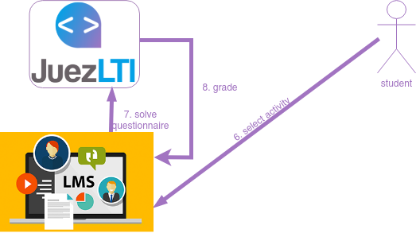
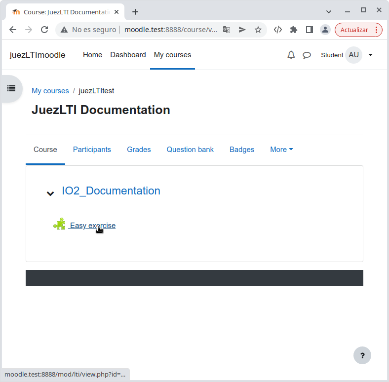
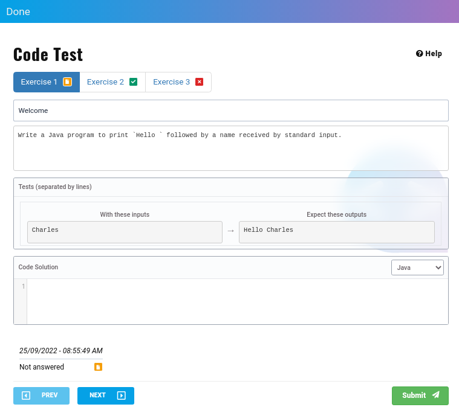
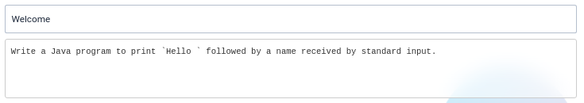
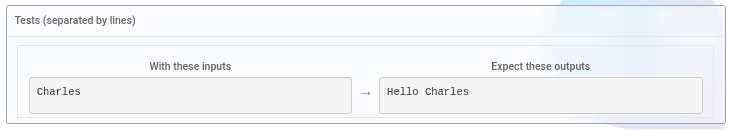
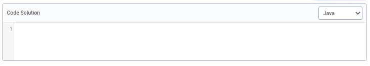
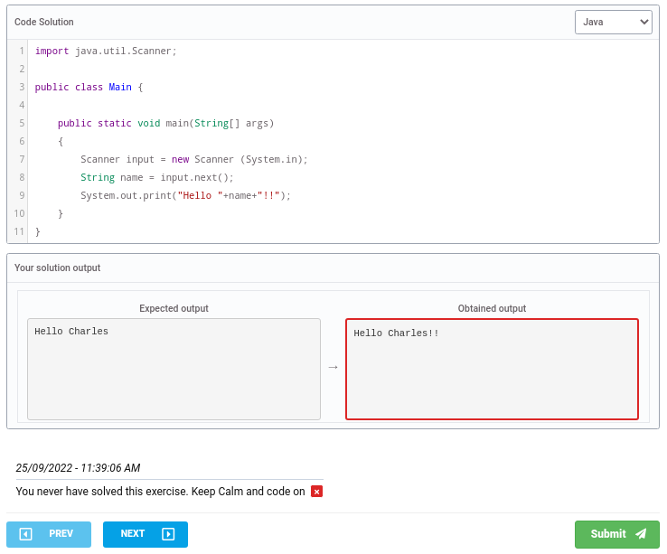
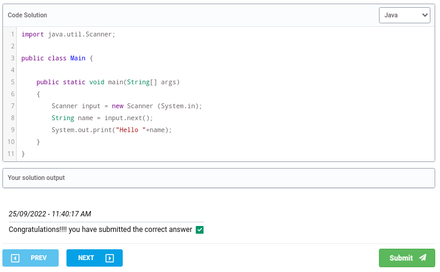

# Vista do Estudante



Assim que os instrutores tenham criado a **actividade da ferramenta externa**  ou , os estudantes poderão vê-la na :sua página do curso:



O estudante do precisa de clicar na Actividade Externa. Neste caso _Easy exercise_

Aparecerá uma Vista do Estudante semelhanta à imagem abaixo:


No topo da página, é apresentada a lista de exercícios que compõe a actividade:


O exemplo acima mostra uma actividade composta por três exercícios, em um dos três estados possíveis:

- _laranja_: o estudante não respondeu ao exercício.
- _verde_: o estudante resolveu o exercício.
- _vermelho_: o estudante apresentou uma resposta errada.

O estudante pode utilizar a lista de exercícios para navegar através dos exercícios, clicando neles.

Após a lista de exercícios, o título e a descrição do exercício são encontrados



e um conjunto de testes



Nesses testes, o aluno pode visualizar o _output_ que corresponde a cada _input_. No exemplo acima, se o código receber `Charles`, deve retornar `Hello Charles`.

O estudante deve codificar a sua solução no campo _Code Solution_, seleccionando previamente em que linguagem será codificada a solução:



No final da página o aluno receberá a nota e o feedback da sua resposta.

Abaixo, é possível ver o resultado de dois excertos de códigos diferentes:

- Resposta errada:

```
import java.util.Scanner;

public class Main {

    public static void main(String[] args)
    {
        Scanner input = new Scanner (System.in);
        String name = input.next();
        System.out.print("Hello "+name+"!!");
    }
}
```


- Resposta correcta:

```
import java.util.Scanner;

public class Main {

    public static void main(String[] args)
    {
        Scanner input = new Scanner (System.in);
        String name = input.next();
        System.out.print("Hello "+name);
    }
}
```


