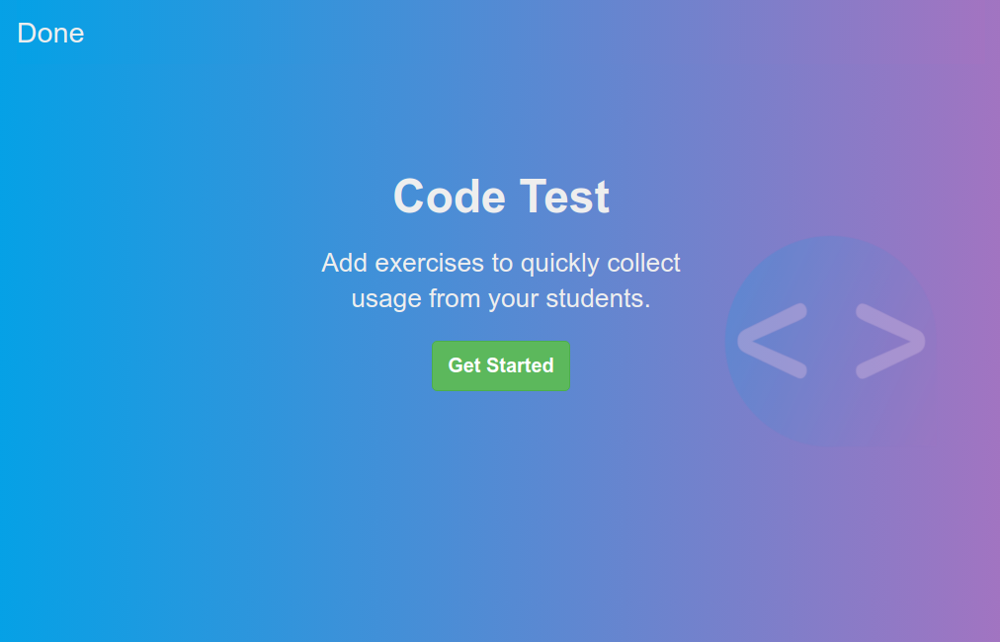
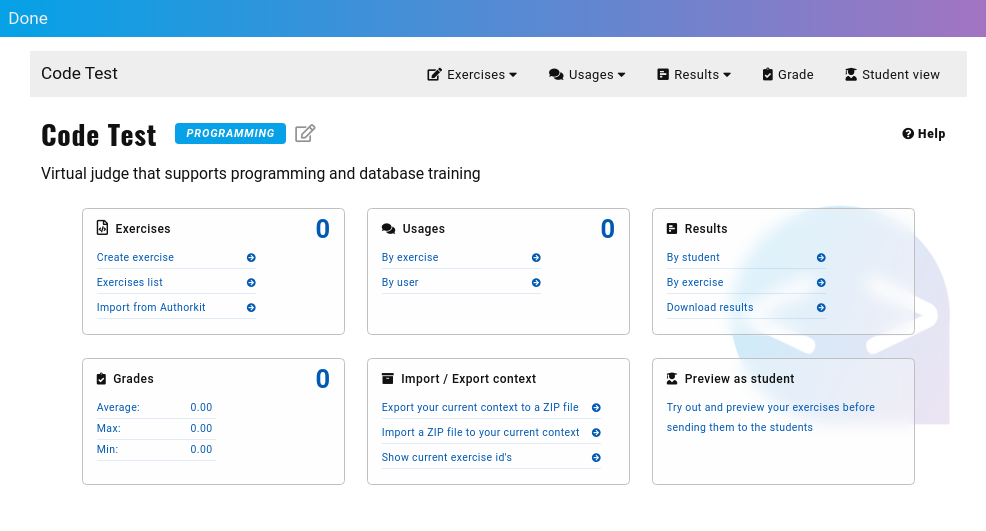
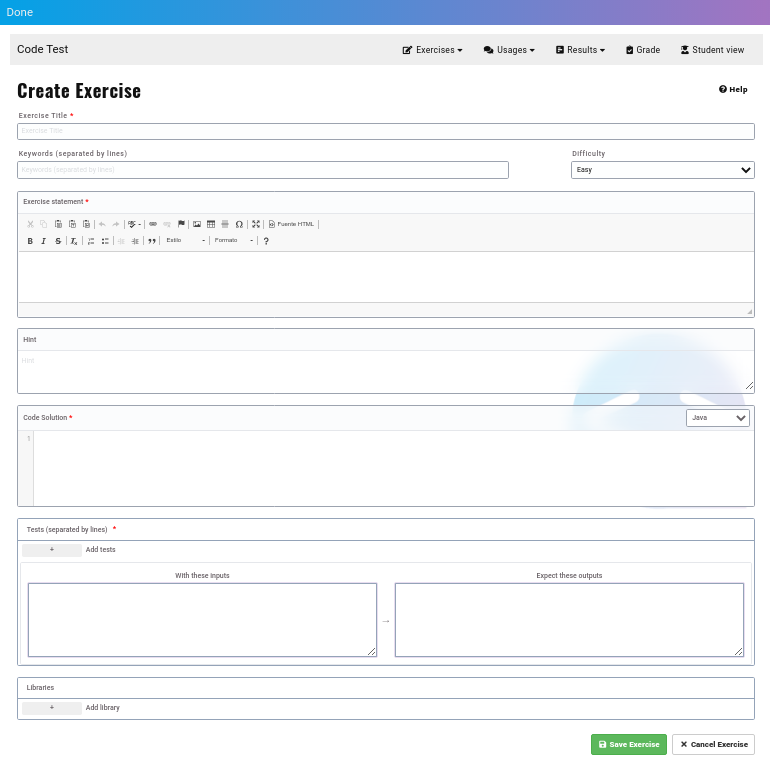

# Vista do Professor


Depois de criada a **actividade da ferramenta extrerna**  ou , surgirá a página de boas-vindas:



Basta clicar no botão **Get Started**

Aparece o Centro de Controlo do Professor:


Inicialmente, todos os contadores estão a **0**:
- Exercises
- Usages
- Grades

## Criação de exercícios

Como JuezLTI usa o formato [_YAPExIL_](https://raw.githubusercontent.com/FGPE-Erasmus/format-specifications/master/schemas/yapexil.schema.json) para armazenar todos os tipos de exercícios, a interface para criar exercícios é a mesma para programação, bases de dados ou exercícios de linguagens de marcação.

A imagem abaixo mostra o formulário para definir exercícios:


## Exemplos
Os exemplos abaixo mostram como preencher o formulário CodeTest para obter um exercício em Java ou PostgreSQL.

Para exercícios que necessitam de mais propriedades YAPExIL, o JuezLTI recomenda [Authorkit](https://python.usz.edu.pl/authorkit/ui/dashboard). 
### Exercício de exemplo em Java:
- **Exercise Title**: `Welcome`
- **Keywords**: `Input, Output`
- **Exercise statement**: Escreva um programa Java para imprimir 'Olá' seguido de um nome recebido por _input_ padrão.

- **Code Solution**: 
```
import java.util.Scanner;

public class Main {

    public static void main(String[] args)
    {
        Scanner input = new Scanner (System.in);
        String name = input.next();
        System.out.print("Hello "+name);
    }
}
```

- **Linguagem**: Java

- **With these inputs**: `Charles`

- **Expect these outputs**: `Hello Charles`

- **Add library**: _De momento é utilizado apenas para fornecer um script com dados iniciais para **testar exercícios da base de dados**_.

Click on **Save Exercise** button and access to Exercises list page. From there, you are able to edit or delete any exercise created with CodeTest.

### Exercícios de exemplo em PostgreSQL:

O JuezLTI permite a criação de exercícios de DQL, DDL e DML. Segue um exercício de exemplo de DDL:
- **Exercise Title**: `ALTER TABLE: RENAME`
- **Keywords**: `DDL, RENAME TABLE`
- **Exercise statement**: 
```
Imagine que criámos a seguinte tabela:
    CREATE TABLE SUBJECTS (
        Name VARCHAR(100),
        NumHours INTEGER
    );
Renomeie a tabela SUBJECTS para MODULES.
```

- **Code solution**: 
```
ALTER TABLE SUBJECTS RENAME TO MODULES;
```

- **Language**: PostgreSQL

- **With these inputs**: 
```
SELECT table_name, column_name, data_type
FROM information_schema.columns
WHERE lower(table_name) in ('modules', 'subjects') and table_schema = 'public'
ORDER BY column_name;
```

- **Expect these outputs**:
```
 table_name | column_name |     data_type     
------------+-------------+-------------------
 modules    | name        | character varying
 modules    | numhours    | integer
(2 rows)
```

- **Add library**: Clicar no botão **+** e preencher com estes valores:
  - title: `subjects table script`
  - body:
    ```
    CREATE TABLE SUBJECTS (
        Name VARCHAR(100),
        NumHours INTEGER
    );
    ```

Clicar no botão **Save Exercise** e aceder à página da lista de exercícios. A partir daí, é possível editar, apagar ou reordenar os exercícios criados com o CodeTest.


De seguida, vê-se um exercício de exemplo em DQL:
- **Exercise Title**: `Unconditional SELECT`
- **Keywords**: `DQL, Unconditional`
- **Exercise statement**: 
```
Mostre todos os dados armazenados na tabela _countries_.
```
- **Code solution**: 
```
SELECT * FROM countries
```

- **Language**: PostgreSQL

- **With these inputs**:
Não é necessário nenhum _input_ neste caso, um comentário é suficiente.
```
-- .
```

- **Expect these outputs**:
```
 country_id | country_name | region_id 
------------+--------------+-----------
 ES         | Spain        | 1
 PT         | Portugal     | 1
 SE         | Sweden       | 1
 TR         | Türkiye      | 1
(4 rows)
```

- **Add library**: Clicar no botão **+** e preencher com estes valores:
  - title: `subjects table script`
  - body:
    ```
    CREATE TABLE countries 
        ( country_id CHAR(2) not null PRIMARY KEY       
        , country_name VARCHAR(40) 
        , region_id INTEGER REFERENCES regions(region_id)
        ); 

    INSERT INTO countries VALUES( 'ES', 'Spain', 1);
    INSERT INTO countries VALUES( 'PT', 'Portugal', 1);
    INSERT INTO countries VALUES( 'SE', 'Sweden', 1);
    INSERT INTO countries VALUES( 'TR', 'Türkiye', 1);
    ```

Clicar no botão **Save Exercise**.
## Importação de exercícios de Authorkit

A equipa do JuezLTI partilhou vários conjuntos de exercícios no [_Authorkit_](https://python.usz.edu.pl/authorkit/ui/dashboard) para permitir aos instrutores utilizar o JuezLTI com o menor esforço possível:
- [101 exercícios Java](https://python.usz.edu.pl/authorkit/ui/projects/7f1dc980-a4ed-4c94-9488-e3db1f36c7e1/exercises)
- Exercícios PostgreSQL
  - [58 exercícios DQL](https://python.usz.edu.pl/authorkit/ui/projects/3b71a2f0-e295-4a95-988d-bd6aa9b73ca8/exercises)
  - [22 exercícios DDL](https://python.usz.edu.pl/authorkit/ui/projects/4f0281e5-2543-49a9-b0e5-83324553a579/exercises)
  - [16 exercícios DML](https://python.usz.edu.pl/authorkit/ui/projects/83a38e8c-e4c4-45d3-b1a6-ec7509c433d5/exercises)

Cada exercício do _Authorkit_ pode ser importado para JuezLTI. Basta aceder a _Import from Authorkit_ no menu/painel _Exercises_.

Quando _Import from Authorkit_ é seleccionado, aparece uma nova janela que mostra os grupos de exercícios públicos.

O JuezLTI sugere que se comece com grupos de exercícios que já tenham sido testados:
- JuezLTI Programming
- MOOC exercises DB: DQL
- MOOC exercises DB: DDL
- MOOC exercises DB: DML

Clique no grupo desejado e depois escolha o exercício que pretende importar.


Acedendo a _Exercises list_ é possível ver que os exercícios foram importados, embora os exercícios importados do _Authorkit_ não possam ser editados.


