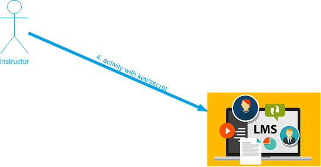

# Utilização do JuezLTI no Moodle

A partir do Moodle 2.2, a **Ferramenta Externa** permite aos utilizadores interagirem com recursos e actividades de aprendizagem compatíveis com LTI noutras páginas Web. As **Atividades da Ferramenta Externa** são a forma correcta de utilizar o JuezLTI a partir do Moodle.

Segue um resumo da documentação [Ferramenta Externa](https://docs.moodle.org/400/en/External_tool) na página oficial do Moodle (apenas dísponivel em inglês de momento).

Dependendo dos seus privilégios na plataforma Moodle da sua instituição, poderá configurar a ferramenta LTI a nível de actividade ou a nível de administração da página.

## Nível de actividade

Depois de ter seleccionado a **actividade da ferramenta externa**  ou  terá de preencher o formulário:

- **Nome da actividade** -  adicionar um título, descrição se necessário, com a escolha de visualização.
- **Ferramenta pré-configurada** - é desta forma que o Moodle comunica com o fornecedor de ferramentas. Em caso de dúvida, deixar como padrão. Se o seu administrador tiver disponibilizado uma ferramenta em todo o site, poderá seleccioná-la aqui:

- **URL da ferramenta** - Este é o URL de ligação ao site. Se o seu Moodle usa [SSL](https://en.wikipedia.org/wiki/Transport_Layer_Security) (usa o protocolo [HTTPS](https://docs.moodle.org/400/en/HTTPS)) só poderá utilizar uma ferramenta que também utilize [SSL](https://en.wikipedia.org/wiki/Transport_Layer_Security). Certifique-se de que o URL da ferramenta tem [HTTPS](https://docs.moodle.org/400/en/HTTPS) antes de tentar utilizá-lo ou poderá obter uma página em branco.

    No beta de JuezLTI, o URL deve ser preenchido com [https://beta.juezlti.eu/tsugi/mod/codetest/](https://beta.juezlti.eu/tsugi/mod/codetest/). _Não esquecer o "/" no final_.

- **_Container_ de arranque**- é assim que a ferramenta externa será exibida.
    - Padrão - em caso de dúvida, deixar em padrão
    - Integrar - a ferramenta externa será integrada na página do curso Moodle com blocos e barra de navegação
    - Integrar sem blocos - a ferramenta externa será integrada na página do curso Moodle mas sem blocos
    - Nova Janela - a ferramenta externa irá abrir numa nova janela. (A antiga janela do navegador contendo a página do curso não será alterada).

_As seguintes configurações estão disponíveis clicando em "Show more":_
- **Descrição da actividade** - insira uma descrição curta aqui
- **Mostrar descrição na página do curso** - mostrar a descrição juntamente com o nome da actividade
- **Mostrar nome da actividade no arranque** - mostrar quando o aluno clica no link.
- **Mostrar descrição da actividade no arranque** - mostrar quando o aluno clica no link.
- **URL da ferramenta segura** - Anula o URL da ferramenta quando o Moodle usa [SSL](https://en.wikipedia.org/wiki/Transport_Layer_Security) (se a página estiver configurada para usar [HTTPS](https://docs.moodle.org/400/en/HTTPS) no wwwroot)
- **<u>Chave do cliente</u>** - aqui é onde deve colocar a [**chave** emitida pelo JuezLTI](gettingCredentials.md).
- **<u>Segredo partilhado</u>** - e aqui o **segredo**.
- **Parâmetros personalizados** - na maioria das vezes pode deixar isto em branco. O fornecedor da ferramenta poderá utilizá-lo para permitir a exibição de um recurso específico.
- **Ícone URL** - pode exibir um ícone diferente do ícone padrão da Ferramenta Externa, introduzindo aqui o seu URL.
- **URL de Ícone Seguro** - introduza aqui o URL de um ícone diferente se os seus alunos estiverem a aceder ao Moodle de forma segura através de [SSL](https://en.wikipedia.org/wiki/Transport_Layer_Security).

## Privacidade

- **Partilhar nome do aluno com a ferramenta** - isto significa que o nome do aluno será exibido no site [como neste exemplo](https://docs.moodle.org/400/en/images_en/1/13/demoexternaltool.png)
- **Partilhar o e-mail do aluno com a ferramenta** - isto significa que o email do aluno será exibido no site [como neste exemplo](https://docs.moodle.org/400/en/images_en/2/27/externaltoolfrontpage.png)
- **Aceitar notas da ferramenta** - se activado, o site enviará de volta as notas para o livro de notas do Moodle. Ver [Using External tool](https://docs.moodle.org/400/en/Using_External_tool) (apenas dísponivel em inglês de momento) para mais informações sobre este assunto.

## Definições de administração do site

### Adicionar uma ferramenta em todo o site

Um administrador pode configurar manualmente as ferramentas externas em _Site administration > Plugins > Activity modules > External tool> Manage tools_ para que estejam disponíveis em todo o site.

Uma ferramenta pode ser configurada por um administrador para que seja mostrada na escolha de actividades (para além da actividade da ferramenta externa) para um professor escolher para acrescentar a um curso. A sua descrição, se existir, aparecerá na escolha de atividades.

### Ver mais detalhes

Na página _'Manage tools'_ é também possível visitar _'Manage preconfigured tools'_ para ver as ferramentas pré-configuradas numa tabela.

Existem separadores para adicionar uma ferramenta externa, para visualizar os que estão pendentes e os que foram rejeitados:

Também pode visitar _'Manage external tool registrations'_ para ver os registos das ferramentas numa tabela ou para adicionar um registo externo com capacidades limitadas.

Para adicionar uma ferramenta com capacidades limitadas.
1. Clique em _'Configure a new external tool registration'_

2. Configurar os detalhes na página de definições:

_'Memberships'_, permitir que a ferramenta externa solicite uma lista de utilizadores com um determinado papel num contexto específico, por exemplo, utilizadores inscritos num curso.

3. Clique na caixa de verificação para se registar:

4. Depois de obter uma mensagem de sucesso, clique para completar o processo:

5. Se todos os requisitos forem cumpridos, será possível registar automaticamente.

6. Depois vá a _Site administration > Plugins > Activity modules > External tool > Manage external tool types_ e clique em 'Pending tab'

7. Clique na caixa de verificação para o ativar:

Ver o screencast [Registo de ferramentas externas](http://www.spvsoftwareproducts.com/temp/lti2-moodle/) para uma demonstração dos passos acima referidos.
