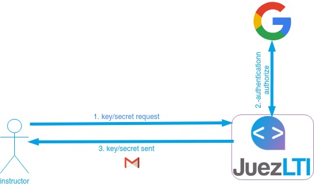
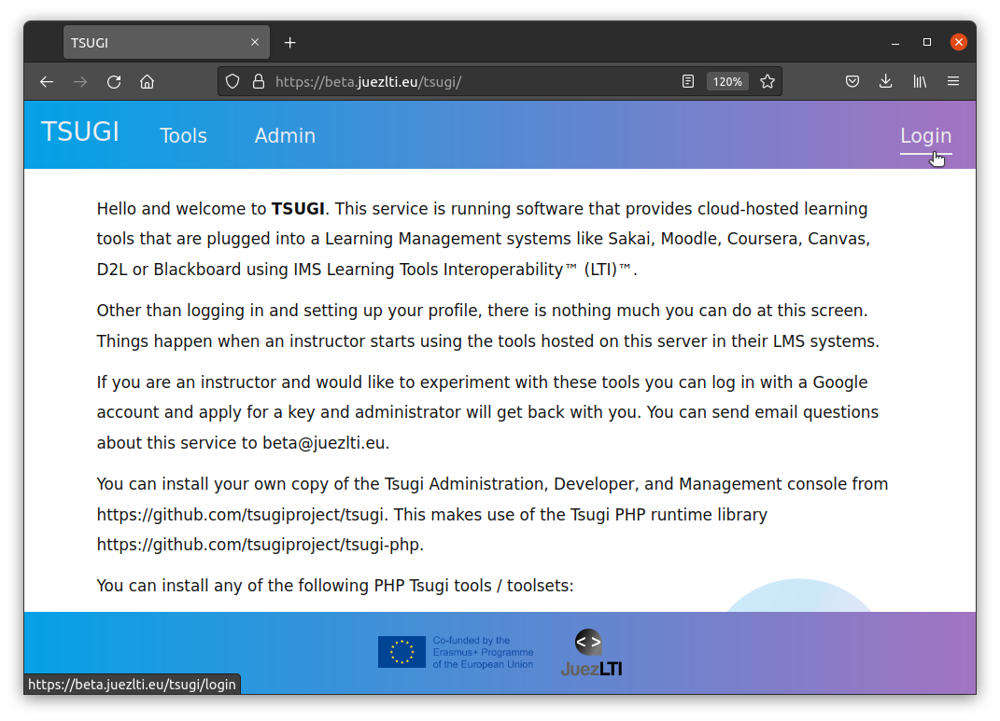
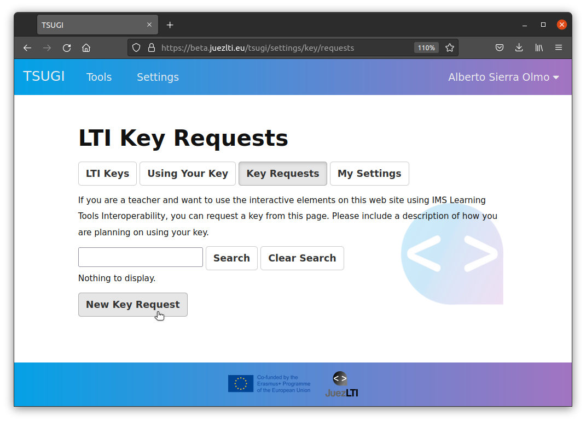
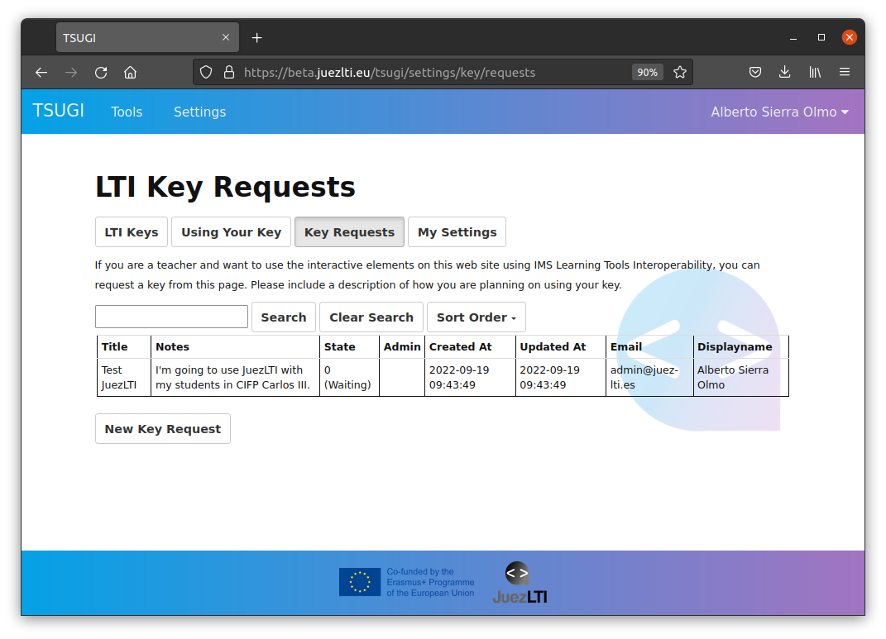

# Hämta nycklar
För att säkra meddelandeinteraktioner mellan LMS och JuezLTI används OAuth-protokollet. OAuth-signering kräver en **nyckel** och delad **hemlighet** för att signera meddelanden. Nyckeln sänds med varje meddelande, såväl som en OAuth-genererad signatur som är baserad på nyckeln. JuezLTI letar upp hemligheten baserat på den tillhandahållna nyckeln och beräknar en egen signatur. Om den beräknade signaturen och den överförda jämförs för att verifiera avsändaren.

Proceduren för att få nyckeln och hemligheten inkluderar:
- [Hämta nycklar](#hamta-nycklar)
  - [JuezLTI-autentisering](#juezlti-autentisering)
  - [Begäran av nyckel/hemlighet](#begaran-av-nyckelhamlighet)
  - [Authorization by JuezLTI admin](#autentisering-av-juezlti-admin)
  - [Nyckel/hemlighet skickad](#nyckelhemlighet-skickad)

Dessa steg visas i bilden nedan:

## JuezLTI-autentisering

JuezLTI använder [Tsugi](https://www.tsugi.org) för att hantera nyckel-/hemliga förfrågningar och Tsugi kräver autentisering med ditt Google-konto. Gå sedan till [JuezLTI Tsugi-sida](https://beta.juezlti.eu/tsugi/) och klicka på Logga in som bilderna nedan visar:

Det valda Google-kontot kommer att få nyckel-/hemlighetsuppgifterna.

Efter autentisering via Google kommer en profilsida att visas och du kommer att kunna välja dina profilinställningar och spara dem genom att klicka på knappen **Spara** eller **Spara profil**:

## Begäran av nyckel/hemlighet

När du är autentiserad klickar du på Inställningar

Om detta är din första begäran kommer du att se en (0) nära **Hantera LMS-åtkomstnycklar**. Klicka på **Hantera LMS-åtkomstnycklar**

Knappen LTI-nycklar markeras och meddelandet _"Du har inga IMS LTI-nycklar för detta system."_ visas under.

Klicka på knappen **Nyckelbegäran**

Och sedan, på **ny nyckelbegäran**

Fyll i formuläret och förklara varför eller var du ska använda nycklarna.

En ny nyckel med status (**Väntar**) har begärts.

## Autentisering av JuezLTI admin

Ett e-postmeddelande skickas till personalen på JuezLTI och din nyckelbegäran kommer att godkännas så snart som möjligt. I det ögonblicket kommer du att få ett e-postmeddelande med bekräftelsen till ditt Google-konto.

## Nyckel/hemlighet skickad

När du får bekräftelsen på godkännande till din e-post kommer du att kunna logga in igen och den godkända nyckeln kommer att visas i avsnittet **LTI Keys**.
