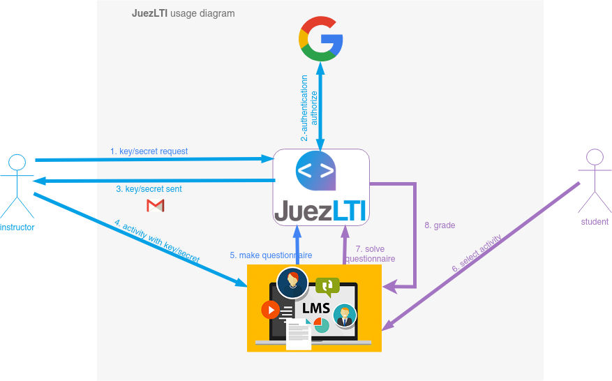

# Vad är JuezLTI?
[JuezLTI](https://juezlti.eu) är ett verktyg som tillåter **automatisk bedömning av datorstudieövningar**, nämligen märkspråk samt programmerings- och databasövningar. Verktyget är också innovativt på grund av dess **kompatibilitet med alla lärplattformar (LMS) som Moodle, Sakai, Canvas eller Blackboard** (med flera) tack vare användningen av LTI-standarden. Detta, tillsammans med biblioteket med övningar som utvecklats i projektet, gör att det kan användas på ett stort antal institutioner, av vilka några har visat intresse och uttryckligt stöd för projektet.

Bilden nedan visar användningsdiagrammet för JuezLTI:
