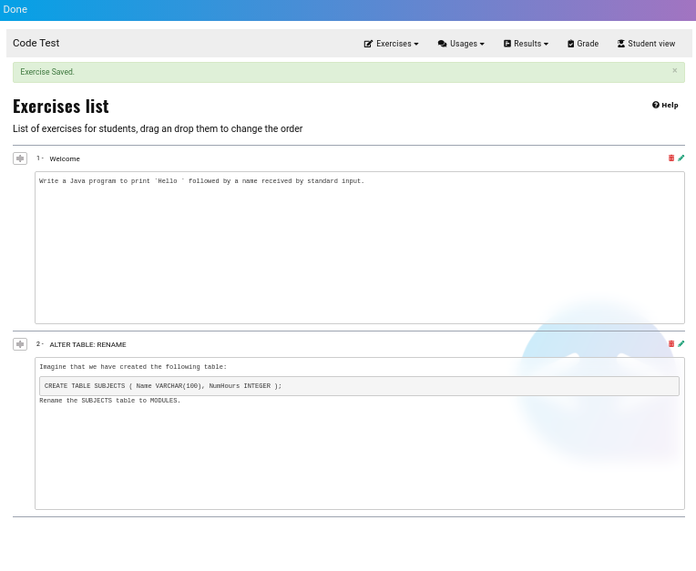
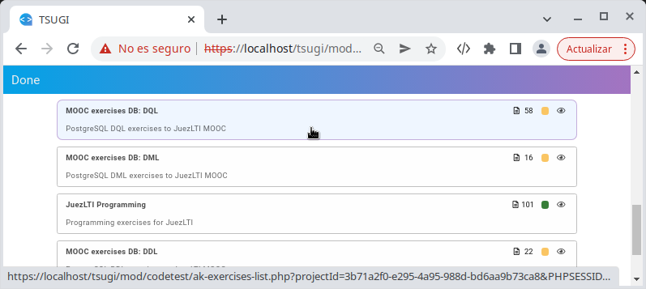

# Lärarvy


När du skapat ett **externt verktyg**  eller  och visar det, kommer du att se en välkomstsida:


Klicka då bara på **Get Started** knappen

Då kommer du att se lärarens kontrollcenter:


När du startar kommer varje räknare att vara **0**:
- uppgifter
- användning
- betyg 

## Skapa en uppgift

Efterson JuezLTI använder sig av [_YAPExIL_](https://raw.githubusercontent.com/FGPE-Erasmus/format-specifications/master/schemas/yapexil.schema.json) formatet för att spara alla uppgiftstyper så är gränssnittet samma vare sig du skapar en uppgift för programmering, databaser eller ett märkspråk.

Bilden nedan visar formuläret för at skapa en uppgift:


## Exempel
Exemplen nedan visar hur du fyller i formuläret för CodeTest för att få en Java- eller PostgreSQLuppgift.

För uppgifter som kräver mer egenskaper från YAPExIL rekommenderar JuezLTI [Authorkit](https://python.usz.edu.pl/authorkit/ui/dashboard). 
### Exempelövning Java:
- **Uppgiftens titel**: `Welcome`
- **Nyckelord**: `Input, Output`
- **Uppgiftsbeskrivning**: Skriv ett Java-program som skriver ut "Hej" följt av ett namn som ska läsas in via standard input.

- **Kodlösning**: 
```
import java.util.Scanner;

public class Main {

    public static void main(String[] args)
    {
        Scanner input = new Scanner (System.in);
        String name = input.next();
        System.out.print("Hello "+name);
    }
}
```

- **Språk**: Java

- **Med dessa indata**: "Charles"

- **Förväntas dessa utdata**: "Hej Charles"

- **Addera bibliotek**: _För närvarande används detta bara för att kunna använda test data för att **testa databasuppgifter**_.

Klicka på knappen **Spara uppgift** för att komma till uppgiftslistan. Från den sidan kan du välja att redigera eller ta bort uppgifter som du skapat med CodeTest.

### Exempeluppgift PostgreSQL:

JuezLTI tillåter dig att skapa uppgifter av typen DQL, DDL och DML. Nedan följer ett exempel på att skapa en DDL-uppgift:
- **Uppgiftens titel**: "ALTER TABLE: RENAME"
- **Nyckelord**: `DDL, RENAME TABLE`
- **Uppgiftbeskrivning**: 
```
Tänk dig att vi har skapat följande tabell:
    CREATE TABLE SUBJECTS (
        Name VARCHAR(100),
        NumHours INTEGER
    );
Byt namn på tabellen SUBJECTS till MODULES.
```

- **Code solution**: 
```
ALTER TABLE SUBJECTS RENAME TO MODULES;
```

- **Språk**: PostgreSQL

- **Med dessa indata**: 
```
SELECT table_name, column_name, data_type
FROM information_schema.columns
WHERE lower(table_name) in ('modules', 'subjects') and table_schema = 'public'
ORDER BY column_name;
```

- **Förväntas dessa utdata**:
```
 table_name | column_name |     data_type     
------------+-------------+-------------------
 modules    | name        | character varying
 modules    | numhours    | integer
(2 rows)
```

- **Addera bibliotek**: Klicka på knappen **+** och fyll i dessa värden:
  - titel: "uppgiftens tabellskript"
  - innehåll:
    ```
    CREATE TABLE SUBJECTS (
        Name VARCHAR(100),
        NumHours INTEGER
    );
    ```

Klicka på knappen **Spara uppgift** för att komma till uppgiftslistan. Från den sidan kan du välja att redigera eller ta bort uppgifter som du skapat med CodeTest.


Nedan följer ett exempel på en DQL-uppgift:
- **Uppgiftens titel**: `Unconditional SELECT`
- **Nyckelord**: `DQL, Unconditional`
- **Uppgiftsbeskrivning**: 
```
Visa alla data som finns sparat i tabellen countries.
```
- **Kodlösning**: 
```
SELECT * FROM countries
```

- **Språk**: PostgreSQL

- **Med dessa indata**:
Vi behöver inga input så en kommentar är tillräckligt
```
-- .
```

- **Förväntas följande utdata**:
```
 country_id | country_name | region_id 
------------+--------------+-----------
 ES         | Spain        | 1
 PT         | Portugal     | 1
 SE         | Sweden       | 1
 TR         | Türkiye      | 1
(4 rows)
```

- **Addera bibliotek**: Klicka på knappen **+** fyll i följande värden:
  - Titel: `countries tabelskript`
  - Innehåll:
    ```
    CREATE TABLE countries 
        ( country_id CHAR(2) not null PRIMARY KEY       
        , country_name VARCHAR(40) 
        , region_id INTEGER REFERENCES regions(region_id)
        ); 

    INSERT INTO countries VALUES( 'ES', 'Spain', 1);
    INSERT INTO countries VALUES( 'PT', 'Portugal', 1);
    INSERT INTO countries VALUES( 'SE', 'Sweden', 1);
    INSERT INTO countries VALUES( 'TR', 'Türkiye', 1);
    ```

Klicka på knappen **Spara uppgift** för att komma till uppgiftslistan. Från den sidan kan du välja att redigera eller ta bort uppgifter som du skapat med CodeTest.

## Importera uppgifter från Authorkit

JuezLTI-teamet har delat olika grupper av uppgifter i [Authorkit](https://python.usz.edu.pl/authorkit/ui/dashboard) för att kunna låta lärare använda JuezLTI med så liten ansträngning som möjligt:
- [101 Java-uppgifter](https://python.usz.edu.pl/authorkit/ui/projects/7f1dc980-a4ed-4c94-9488-e3db1f36c7e1/exercises)
- PostgreSQL exercises
  - [58 DQL-uppgifter](https://python.usz.edu.pl/authorkit/ui/projects/3b71a2f0-e295-4a95-988d-bd6aa9b73ca8/exercises)
  - [22 DDL-uppgifter](https://python.usz.edu.pl/authorkit/ui/projects/4f0281e5-2543-49a9-b0e5-83324553a579/exercises)
  - [16 DML-uppgifter](https://python.usz.edu.pl/authorkit/ui/projects/83a38e8c-e4c4-45d3-b1a6-ec7509c433d5/exercises)

Varje AuthorKit-uppgift kan importeras till JuezLTI genom att välja _Importera från AuthorKit_ i menyn eller panelen _Uppgfiter_.

När _Importera från Authorkit_ väljs visas ett fönstersom visar vilka grupper av uppgifter som är publika.

JuezLTI rekommenderar att börja med grupperna med uppgifter som redan har testats:
- JuezLTI Programming
- MOOC exercises DB: DQL
- MOOC exercises DB: DDL
- MOOC exercises DB: DML

Klicka på önskad grupp och välj sedan den uppgift som du vill importera.



Genom _Uppgiftslistan_ kan du se att uppgifterna blivit importerade. Uppgifter importerae från AuthorKit går inte att redigera.


