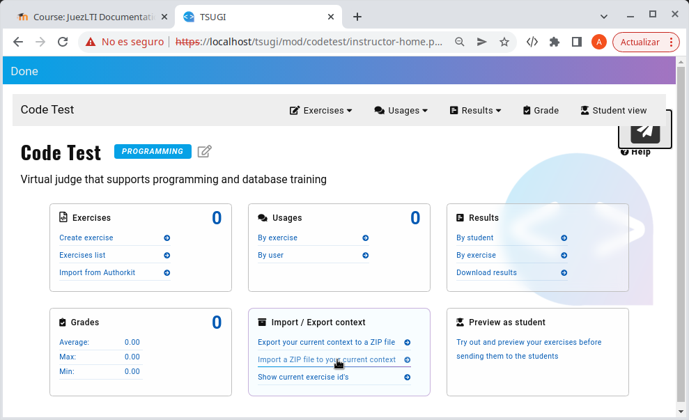

# Säkerhetskopiering och återställning

Instruktörer kan exportera (aktiviteten) med övningarna den är sammansatt av för att importera den till en annan aktivitet eller LMS.

Stegen för att göra det skulle vara följande:

1. Exportera till en zip-fil genom att välja alternativet som visas i bilden nedan.

2. Skapa en ny aktivitet i LMS som den förklaras i kapitlet _[Använda i Moodle](anvandaIMoodle.md)_.
3. Öppna aktiviteten och få tillgång till _Lärarvy_
4. Importera zip-filen som tidigare laddats ner.

5. Bekräfta importen.

Till slut ser du hur antalet övningar har förändrats och ökat till antalet övningar som hör till den ursprungliga filen.
