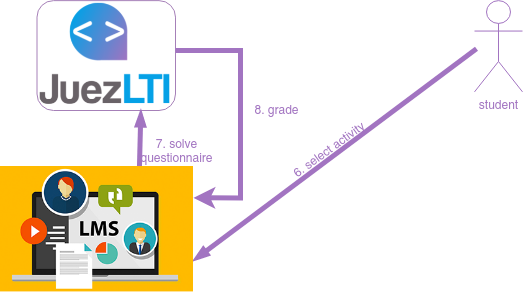
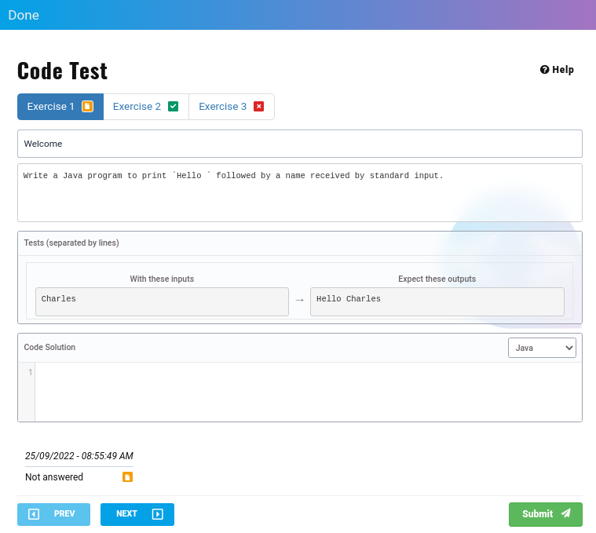
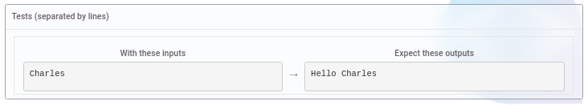
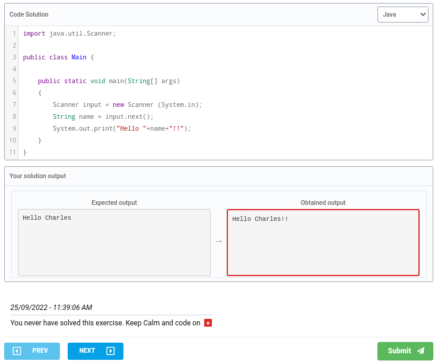

# Studentvy



När instruktörerna har skapat ett **externt verktyg**  eller  kan studenterna se det på sin kurssida:


Studenten behöver bara klicka på den externa aktiviteten. I det här fallet, _Lätta uppgifter_

En studentvy som liknar bilden nedan visas:


Överst på sidan visas listan över uppgifter som ingår i aktiviteten:


Exemplet ovan visar en aktivitet som består av tre övningar, i ett av de tre möjliga tillstånden vardera:

- _orange_: studenten svarade inte på övningen.
- _grön_: studenten löste övningen.
- _röd_: studenten gav ett felaktigt svar på övningen.

Studenten kan använda listan med övningar för att navigera genom övningarna, benom att klicka på dem.

Efter övningslistan återfinns övningens titel och beskrivning


och grupper av uppgifter



I de uppgifterna kan studenten se utdata som motsvarar varje indata. I exemplet ovan, om koden tar emot "Charles", måste den returnera "Hello Charles".

Studenten ska skriva sin kodlösning i fältet _Kodlösning_ och sedan välja på vilket språk lösningen ska kodas:


Längst ner på sidan får studenten betyget och feedback på sitt svar.

Ovan kan du se resultatet av två olika koder:

- Fel svar:

```
import java.util.Scanner;

public class Main {

    public static void main(String[] args)
    {
        Scanner input = new Scanner (System.in);
        String name = input.next();
        System.out.print("Hello "+name+"!!");
    }
}
```


- Rätt svar:

```
import java.util.Scanner;

public class Main {

    public static void main(String[] args)
    {
        Scanner input = new Scanner (System.in);
        String name = input.next();
        System.out.print("Hello "+name);
    }
}
```
