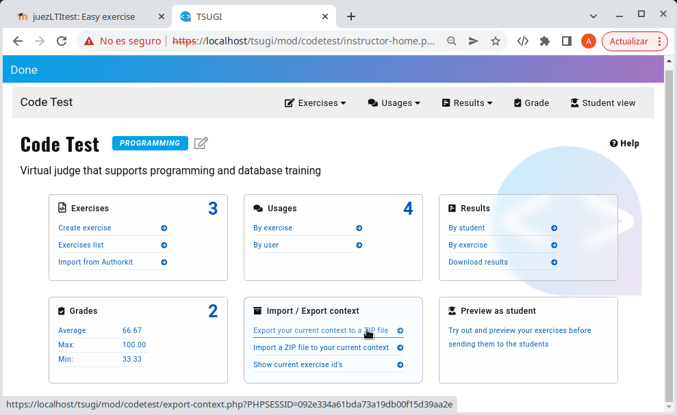

# Yedekleme ve Geri yükleme

Eğitmenler içeriği (aktiviteyi) oluşturduğu alıştırmalarla birlikte dışa aktarabilir, daha sonra farklı bir aktivitede veya LMS de içe aktarabilirler.

Bunu yapmak için aşağıdaki adımlar izlenmelidir:

1. Aşağıdaki resimde gösterilen seçeneği seçerek, içeriği bir zip dosyasına aktarın.

2._[Using In Moodle](usingInMoodle.md)_ Moodle kullanma bölümünde açıklandığı gibi LMS de yeni bir aktivite oluşturun.
3. Aktiviteyi açın ve öğretmen görünümüne geçin _Teacher View_
4. Daha önce indirilen zip dosyasını mevcut bağlama aktarın.

5. İçe aktarmayı onaylayın.

Alıştırma sayısının orjinal içeriğe ait olana kadar nasıl değiştiğini ve arttığını sonunda göreceksiniz.
