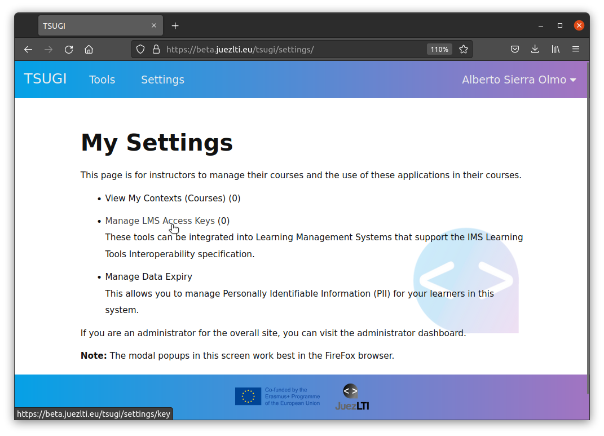
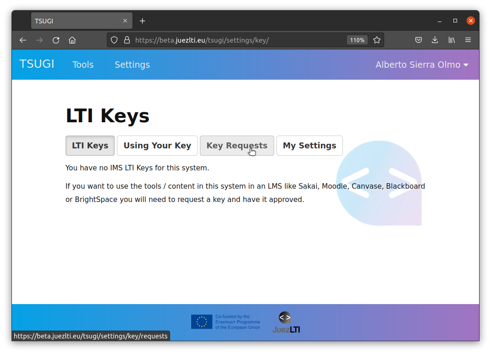

# Kimlik Bilgilerini Alma 
LMS ve JuezLTI arasında mesaj etkil eşimini güvence altına almak için OAuth protokolü kullanılır. OAuth imzalamada, mesajları imzalamak için bir **anahtar** ve paylaşılan **sır/parola** gereklidir. Anahtar her mesajla ve aynı zamanda anahtara dayalı olarak OAuth tarafından oluşturulan imzayla iletilir. JuezLTI, verilen anahtara dayanarak sırrı/parolayı arar ve imzayı yeniden hesaplar ve gönderenin kimlik bilgilerini doğrulamak için yeniden hesaplanan imzayı iletilen imza ile karşılaştırır.

Anahtarı ve parolayı alma işlemi şunları içerir:
- [Kimlik bilgilerini alma](#getting-credentials)
  - [JuezLTI kimlik doğrulaması](#juezlti-authentication)
  - [Anahtar/parola talebi](#keysecret-request)
  - [JuezLTI yöneticisi tarafından yetkilendirme](#authorization-by-juezlti-admin)
  - [Anahhtar/Parola gönderme](#keysecret-sent)

Bu adımlar aşağıdaki şemada gösterilmektedir:

## JuezLTI doğrulama

JuezLTI anahtar/parola talebini yönetmek için [Tsugi](https://www.tsugi.org)sitesini kullanır ve Tsugi Google hesabınızla doğrulama ister. Daha sonra [JuezLTI Tsugi ye gidin page](https://beta.juezlti.eu/tsugi/) ve aşağıdaki resimde görüldüğü gibi Login e tıklayın:

Seçilen Google hesabınıza anahtar/parola bilgileriniz gelecektir.

Google doğrulamasından sonra bir profil sayfası açılacak ve oradan profil ayarlarınızı seçebileceksiniz. **Save** veya **Save profile Data** tuşuna basarak kaydedeblilirsiniz: 

## Anahtar/parola talebi 

Doğrulandıktan sonra Ayarlara tıkla

Eğer bu ilk girişiniz ise, **Manage LMS Access Keys** tuşları yanında (0) göreceksiniz **Manage LMS Access Keys** üzerine tıklayın.

LTI Keys button appears selected and the message _"You have no IMS LTI Keys for this system."_ below.

Click on **Key Request** button

And, then, on **New Key Request**

Formu doldurun, kimlik bilgilerini niçin veya nerede kullanacağınızı lütfen açıklayınız.

A new key with state (**Waiting**) has been requested.

## JuezLTI yöneticisi tarafından doğrulanma

Talep ile birlikte, talebi en kısa sürede onaylayacak olan JuezLTI personeline bir e-posta gönderilecektir. Onayın ardından belirtilen Google hesabınıza bir
onay e-postası alacaksınız. 

## Anahtar/Parola gönderimi

Onay e-postası aldığınızda yeniden giriş yapabileceksiniz ve onaylanan anahtar *LTI Keys** bölümünde gösterilecek
.

