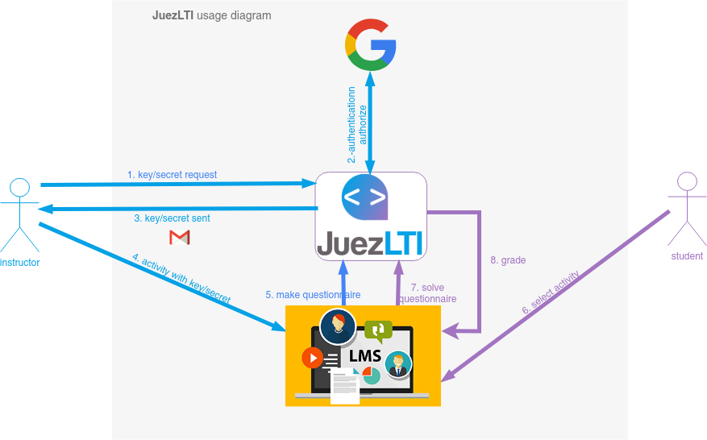

# JuezLTI Nedir? 
[JuezLTI](https://juezlti.eu) programlama alıştırmaları, veri tabanları ve biçimlendirme dilleri dahil olmak üzere bilişim öğretim alıştırmalarının otomatik olarak değerlendirilmesini sağlayan bir araçtır. Bu araç, LTI standartının kullanımı nedeniyle diğer bir çok sistemin yanı sıra **Moodle, Sakai, Canvas veya Blackborad gibi öğrenme yönetim sistemkeriyle (LMS) birlikte çalışabilirliği nedeniyle yenilikçidir. Buna ilaveten projeyle geliştirilen alıştırma havuzu nedeniyle sayısız  kurumda kullanıma uygundur ve halihazırda bir çok kurum projeye ilgi göstermekte ve açık destek vermemktedir.  
 
Aşağıdaki diyagram JuezLTI kullanımını göstermektedir: 
 

