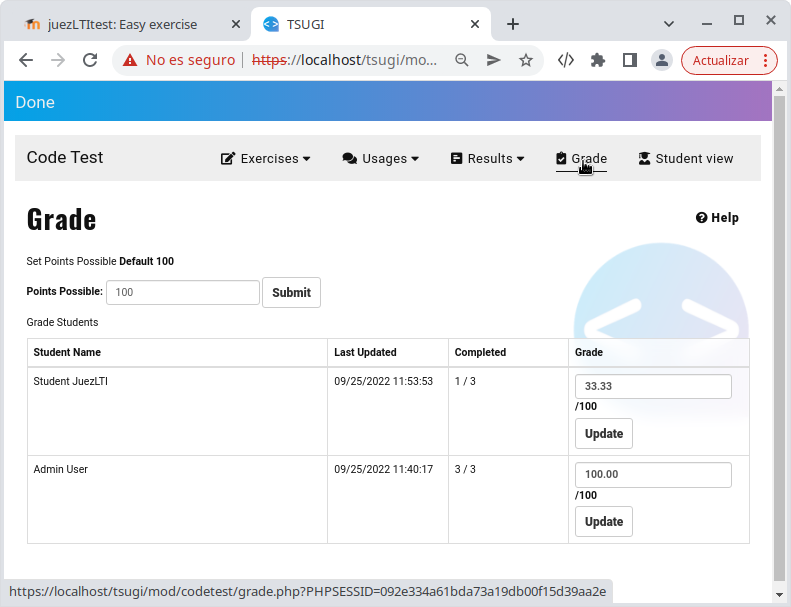

# Sonuçları Değerlendirme

Eğitmenlerin öğrenci sonuçlarını gözden geçirebileceği iki yer vardır:

  - [Öğretmen görünümünde sonuçları değerlendirme](#reviewing-results-in-teacher-view)
  - [Sınıf LMSye göre sonuçları değerlendirme] (#reviewing-results-in-grade-l ms)

## Öğretmen Görünümünde sonuçları değerlendirme

Eğitmenler öğrencilerin aktivitelerini _Results_ menüsünden takip edebilirler. 

Aşağıda JuezLTI _öğrencisi tarafından çözülen alıştırmaların listesi gösterilmiştir: 

Görüldüğü gibi öğrenci, aktivitede verilen üç alıştırmadan birini çözmüştür. Eğitmen _SHOW CODE_ tıklayarak cevapları görebilir

Sonrasında  in _Grade_ menu de eğitmen öğrenci tarafından verilen seviyeyi görebilir. 

Aşağıdaki görüntüde  _ JuezLTI_öğrencisi tarafından elde edilen notun %33.33 olduğu görülmektedir.

JuezLTI, öğretmenlerin metin kutusundaki değeri değiştirerek ve _Update_ düğmesini tıklayarak öğrencilerin herhangi birinin notunu değiştirmesine olanak tanır. 

## Sonuçları Grade LMS de değerlendirme 

JuezLTI da elde edilen notun LTI standartı kullanılarak LMS ye gönderildiğini unutmayın. Yani öğretmenin JuezLTI da görebildiği notun aynısı LMS de de görülebilmektedir. 

Aşağıdaki gerçek senaryoda, eğitmen öğrencilerin farklı hızlaarda ilerlemelerine izin verir ve öğrencilerin nerede daha fazla zorluk yaşadığını ve kimin daha fazla yardıma ihtiyaç duyduğunu görebilir. 
  

## Sonuçların indirilmesi

Öğrencilerin sonuçlarını içeren elektronik bir tablo da indirilebilir.
