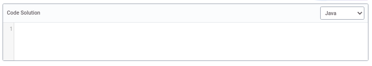

# Öğrenci Görünümü


Eğitmenler **harici tool etkinliği** oluşturduğunda  veya , öğrenciler kendi kurs sayfalarında görebilirler:
 


Öğrencinin yapması gereken tek şey Harici Aktiviteye tıklamaktır, bu durmda _kolay alıştırma_ oluşur. 

Aşağıdaki görüntüye benzer bir öğrenci görünümü oluşur:


Sayfanın üst kısmında aktiviteyi oluşturan alıştırmaların listesi gösterilir: 


Yukarıdaki örnek üç alıştırmadan oluşan bir aktivite örneğidir. Her birinde olası üç durum gösterilmiştir: 

- _turuncu_: Öğrenci alıştırmayı cevaplamadı.
- _yeşil_: öğrenci alıştırmayı çözdü.
- _kırmızı_: öğrenci alıştırmaya yanlış cevap verdi.

Öğrenci alıştırmalar arasında gezinmek için alıştırma listesini kullanabilir ve üzerlerine tıklayabilir. 

Alıştırma listesinden sonra, alıştırma başlığı ve komut bulunabilir.


Ve test seti 


Bu testlerde öğrenci her bir girdiye karşılık gelen çıktıyı görebilir. Yukarıdaki örnekte kod ‘Charles’ ı alırsa, ‘merhaba Charles’ olarak dönmesi gerekir.

Öğrenci, çözümün hangi dilde kodlanacağını önceden seçerek çözümünü _kod Çözüm_ alanına kodlamalıdır:



Öğrenci sayfanın sonunda notunu ve cevabına verilen geribildirimi görecektir.

Aşağıda iki farklı kodun sonuçlarını görebilirsiniz: 

- Yanlış cevap:

```
import java.util.Scanner;

public class Main {

    public static void main(String[] args)
    {
        Scanner input = new Scanner (System.in);
        String name = input.next();
        System.out.print("Hello "+name+"!!");
    }
}
```


- Doğru cevap :

```
import java.util.Scanner;

public class Main {

    public static void main(String[] args)
    {
        Scanner input = new Scanner (System.in);
        String name = input.next();
        System.out.print("Hello "+name);
    }
}
```


