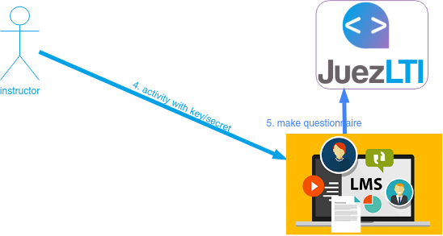

# Öğretmen Görünümü



**harici tool aktivitesi** oluşturduğunuzdaOnce or  bunu görüntülersiniz ve giriş sayfasına ulaşırsınız.
 


Sadece **Başlat** düğmesine tıklayın.

Öğretmen Kontrol Merkezi açılır:


Başlangıçta sayaçların hepsi **0** dır: 
- alıştırmalar
- kullanım
- seviyeler 

## Alıştırma Oluşturma
  
JuezLTI, tüm egzersiz türlerini saklamak için  [_YAPExIL_](https://raw.githubusercontent.com/FGPE-Erasmus/format-specifications/master/schemas/yapexil.schema.json)  formatını kullandığından, alıştırma oluşturma arayüzü programlama, veritabanları veya biçimlendirme dilleri alıştırmaları için aynıdır.


Aşağıdaki resim alıştırmaları tanımlama formunu göstermektedir:
!Alıştırma oluşturma formu](../docs/img/teacherView/teacherViewCreateExerciseForm.png)

## Örnekler
Aşağıdaki örnekler Java veya PostgreSQL alıştırmaları yapmak için CodeTest formunun nasıl doldurulacağını göstermektedir. 

Daha fazla YAPExIL özelliği isteyen alıştırmalar için, JuezLTI [Authorkit](https://python.usz.edu.pl/authorkit/ui/dashboard) kullanılmasını önerir.

### Java alıştırma örnekleri:
- **alıştırma başlığı**: `Welcome`
- **Keywords**: `Input, Output`
- **Alıştırma ifadesi**: Write a Java program to print `Hello ` followed by a name received by standard input.

- **Code solution**: 
```
import java.util.Scanner;

public class Main {

    public static void main(String[] args)
    {
        Scanner input = new Scanner (System.in);
        String name = input.next();
        System.out.print("Hello "+name);
    }
}
```

- **Dil**: Java

- **Bu girdilerle**: `Charles`

- **Bu çıktıları bekleyin**: `Hello Charles`

- **Kütüphane ekle**: _Şu anda sadece **test database alıştırmaları** ilk verileri içeren bir komut dosyası oluşturmak için kullanılmaktadır.
 
**Alıştırma kaydet** düğmesine basın ve alıştırma listelerinin olduğu sayfaya ulaşın. Oradan CodeTest tarafından oluşturulmuş herhangi bir alıştırmayı düzenleyebilir veya silebilirsiniz.
 
### PostgreSQL alıştırma örnekleri:

JuezLTI ile DQL, DDL and DML alıştırmaları oluşturabilirsiniz.Örnekte DDL alıştırması vardır:

- **Alıştırma başlığı**: `ALTER TABLE: RENAME`
- **Keywords**: `DDL, RENAME TABLE`
- **Alıştırma ifadesi**: 
```
Imagine that we have created the following table:
    CREATE TABLE SUBJECTS (
        Name VARCHAR(100),
        NumHours INTEGER
    );
Rename the SUBJECTS table to MODULES.
```

- **Kod çözümü**: 
```
ALTER TABLE SUBJECTS RENAME TO MODULES;
```

- **Dil**: PostgreSQL

- **Bu girdilerle**: 
```
SELECT table_name, column_name, data_type
FROM information_schema.columns
WHERE lower(table_name) in ('modules', 'subjects') and table_schema = 'public'
ORDER BY column_name;
```

- **Bu çıktıları al**:
```
 table_name | column_name |     data_type     
------------+-------------+-------------------
 modules    | name        | character varying
 modules    | numhours    | integer
(2 rows)
```

- **Add library**: Click on **+** button and fill with these values:
  - title: `subjects table script`
  - body:
    ```
    CREATE TABLE SUBJECTS (
        Name VARCHAR(100),
        NumHours INTEGER
    );
    ```

**Alıştırma Kaydet** düğmesine tıklayın ve alıştırma listeleri sayfasına erişin, buradan CodeTest tarafından oluşturulmuş alıştırmaları düzenleyebilir, silebilir veya yeniden sıralayabilirsiniz: 


Next is an example of DQL exercise:
- **Alıştırma Başlığı**: `Unconditional SELECT`
- **Keywords**: `DQL, Unconditional`
- **Alıştırma İfadesi**: 
```
Ülkeler tablosunda kayıtlı tüm datayı göster. ```
- **Kod çözümü**: 
```
SEÇİN * Ülkelerden 
```

- **Dil**: PostgreSQL

- **Bu girdilerle**:
Bir girdiye ihtiyacımız yok. Yorum yeterli. ```
-- .
```

- **Bu çıktıları bekleyin**:
```
 Ülke kod  | ülke_ismi     |  bölge_id 
------------+--------------+-----------
 ES         | Spain        | 1
 PT         | Portugal     | 1
 SE         | Sweden       | 1
 TR         | Türkiye      | 1
(4 sıra)
```

- **Kütüphane ekle**:  **+** tuşuna tıklayın ve şu değerleri girin:
  - başlık: `countries table script`
  - gövde:
    ```
    Ülkeler TABLOSU OLUŞTUR
        ( country_id CHAR(2) not null PRIMARY KEY       
        , country_name VARCHAR(40) 
        , region_id INTEGER REFERENCES regions(region_id)
        ); 

    INSERT INTO countries VALUES( 'ES', 'Spain', 1);
    INSERT INTO countries VALUES( 'PT', 'Portugal', 1);
    INSERT INTO countries VALUES( 'SE', 'Sweden', 1);
    INSERT INTO countries VALUES( 'TR', 'Türkiye', 1);
    ```

 **Alıştırma Kaydet** düğmesine tıklayın

## Authorkit ten alıştırmaları içe aktarma

JuezLTI team has shared different sets of exercises in [Authorkit](https://python.usz.edu.pl/authorkit/ui/dashboard) to allow instructors using JuezLTI with as little effort as possible:
- [101 Java exercises](https://python.usz.edu.pl/authorkit/ui/projects/7f1dc980-a4ed-4c94-9488-e3db1f36c7e1/exercises)
- PostgreSQL exercises
  - [58 DQL exercises](https://python.usz.edu.pl/authorkit/ui/projects/3b71a2f0-e295-4a95-988d-bd6aa9b73ca8/exercises)
  - [22 DDL exercises](https://python.usz.edu.pl/authorkit/ui/projects/4f0281e5-2543-49a9-b0e5-83324553a579/exercises)
  - [16 DML exercises](https://python.usz.edu.pl/authorkit/ui/projects/83a38e8c-e4c4-45d3-b1a6-ec7509c433d5/exercises)

Her authorkit alıştırması JuezLTI içine aktarılabilir.Sadece _Alıştırmalar_ menusu ve panelinden _Authorkit içe aktar_ işlemini yapmanız yeterlidir.
 
_Authorkit’ten_içe aktar eylemi seçildiğinde, kayan bir pencere belirecek ve genel olarak etiketlenen alıştırma gruplarını gösterecektir.

JuezLTI, test edilmiş alıştırma grupları ile başlamanızı önerir.

 - JuezLTI Programming
- MOOC exercises DB: DQL
- MOOC exercises DB: DDL
- MOOC exercises DB: DML

İstediğiniz grubun üzerine tıklayın ve içe aktarmak istediğiniz alıştırmayı seçin.


_Alıştırmalar listesine_ eriştiğinizde alıştırmaların içe aktarıldığını göreceksiniz. Authorkit ten içe aktarılan alıştırmaların düzenlenemez.

