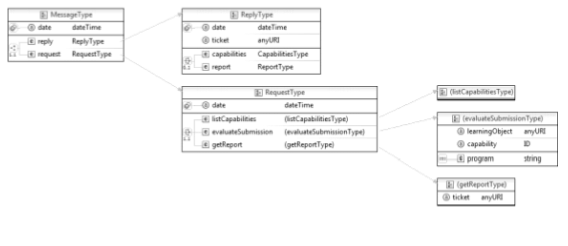

  <a href="README.md">[EN]</a>
  <a href="README_es.md">[ES]</a>
  <a href="README_pt.md">[PT]</a>
  <a href="README_tr.md">[TR]</a>
  <a href="README_sv.md">[SV]</a>

# PEARL 

**P**rogramming **E**xercise **A**ccessement **R**eport **L**anguage (PEARL) é utilizado para formalizar relatórios de avaliação. Os três tipos de pedidos tratados por um serviço que utiliza PEARL são: 

 - `ListCapabilities`: fornece aos sistemas clientes as capacidades de um determinado _evaluator_;
 - `EvaluateSubmission`: permite o pedido de uma avaliação para um exercício de programação específico;
 - `GetReport`: permite que um requerente obtenha um relatório para uma avaliação específica utilizando um _ticket_. 

O diagrama representado na figura acima inclui dois elementos principais: `pedido` e `resposta`. O primeiro chama a função de pedido e os seus parâmetros tal como recebidos pelo serviço de avaliação e o último contém o _output_ para esse pedido.
O elemento `pedido` contém um subelemento diferente de acordo com o tipo de função. O elemento `pedido` inclui dois subelementos que representam as respostas possíveis do serviço, mais precisamente, os elementos `capacidades` e `relatório`.
O elemento de capacidades é utilizado numa resposta da ListCapabilities. Este elemento tem vários subelementos de capacidade, cada um com vários elementos para o descrever. O atributo _ticket_ contém um _ticket_ para obter um relatório numa data posterior.
