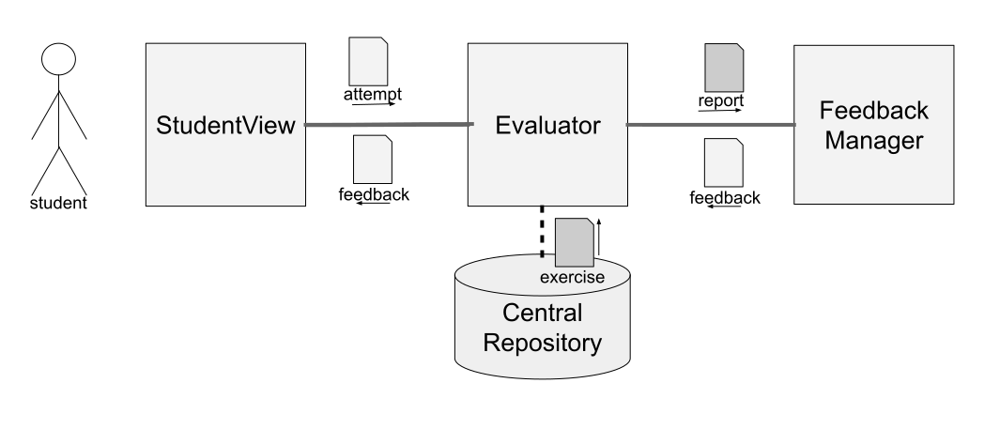

  <a href="README.md">[EN]</a>
  <a href="README_es.md">[ES]</a>
  <a href="README_pt.md">[PT]</a>
  <a href="README_tr.md">[TR]</a>
  <a href="README_sv.md">[SV]</a>

# API Interno

JuezLTI está estruturado em diferentes módulos, como explicado em [Arquitetura do JuezLTI](../Architecture/README_pt.md). Existem quatro tipos de módulos na sua estrutura, nomeadamente:

 - **Vista do Estudante** - onde os alunos tentam resolver exercícios;
 - **Evaluator** - das tentativas dos estudantes enviadas pelo módulo anterior;
 - **Feedback Manager** - processa relatórios gerados por _evaluators_ para produzir mensagens significativas; 
 - **Central Repository** - contém exercícios e outras configurações.

  Embora a maioria destes participantes sejam _singletons_, o **_Evaluator_** é uma espécie de módulo com várias instâncias. Há um _evaluator_ de linguagem de programação, um de linguagens de marcação e um de bases de dados.

O diagrama seguinte ilustra a comunicação entre estes módulos. Através da **Vista do Estudante**, um estudante submete uma tentativa a um **Evaluator**. Este componente avalia esta tentativa utilizando um exercício extraído do **Repositório Central** e produz um **relatório**. O avaliador submete o relatório ao **_Feedback manager_** para produzir um **_feedback_** que é devolvido à **Vista de Estudante** e apresentado ao aluno.

A comunicação entre módulos é regulada por uma API interna [formalizada no Swagger](https://github.com/JuezLTI/APIs/blob/d981488ba77f238f2aaeb6f862ab1c2a0e8252d9/v2/API.yaml#L16). A maioria dos dados comunicados não estão estruturados, com a excepção de exercícios e relatórios que utilizam: 

- [`YAPExIL`](YAPExIL/README_pt.md) -  um formato de exercício de programação;
- [`PEARL`](PEARL/README_pt.md) - um formato comum para relatórios de avaliação.

