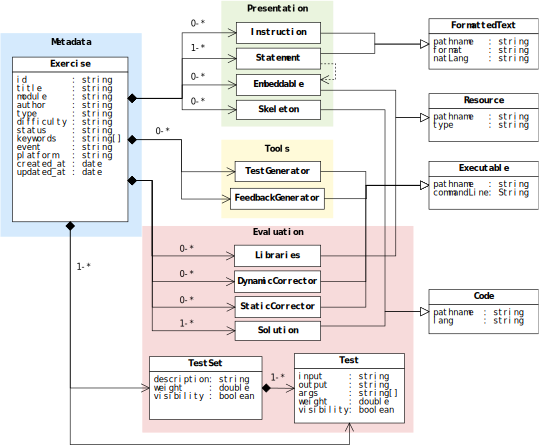

  <a href="README.md">[EN]</a>
  <a href="README_es.md">[ES]</a>
  <a href="README_pt.md">[PT]</a>
  <a href="README_tr.md">[TR]</a>
  <a href="README_sv.md">[SV]</a>

## YAPExIL

**Y**et **A**nother **P**rogramming **Ex**ercises **I**nteroperability **L**anguage (YAPExIL) es un lenguaje que creado para describir paquetes de ejercicios de programación, parcialmente basado en el dialecto PExIL (**P**rogramming **Ex**ercises **I**nteroperability **L**anguage) en XML. Si lo comparamos con PExIL encontraremos las siguientes diferencias, YAPExIL (1) se formaliza a través de un `JSON Schema` en lugar de un `XML Schema`, (2) elimina la lógica compleja para la generación automática de pruebas sin dejar de admitirla a través de scripts, (3) da soporte a diferentes tipos de ejercicios de programación y (4) añade soporte para un número de ventajas (p.e., instrucciones de los autores, generadores de _feedback_ e información de la plataforma).

_YAPExIL_ pretende aglutinar todos los datos requeridos en el ciclo de vida de un ejercicio de computación, incluyendo el soporte de siete tipos de ejercicios de programación:

 - `BLANK_SHEET` provee una hoja en blanco para que los estudiantes escriban su solución desde cero.
 - `EXTENSION` presenta una código fuente que representa una solución parcialmente finalizada, que no debe ser modificada por el estudiante y que éste debe completar.
  - `IMPROVEMENT` facilita un código fuente inicial correcto, el cual no consigue aún todos los objetivos especificados en el ejercicio (p.e. optimiza la solución eliminando los bucles), por lo que el estudiante debe modificarlo para conseguir resolverlo correctamente.
  - `BUG_FIX` ofrece una solución con algunos errores (y que, posiblemente, no pasan alguno de los test) para animar al estudiante a encontrar el código correcto.
  - `FILL_IN_GAP` provee código con algunas partes eliminadas y solicita al estudiante que los rellene con el código correcto.
  - `SPOT_BUG` facilita al estudiante un código con errores y le pide que indique la localización de dichos errores.
  - `SORT_BLOCK` divide un solución en varios bloques de código, los mezcla y solicita al estudiante que los ordene

Para este objetivo, el `YAPExIL JSON Schema` puede ser representado a través de cuatro elementos: **metadata**, que contiene propiedades que facilitan información a cerca del ejercicio; **presentation**, relacionado con lo que el estudiante va a poder visualizar; **assessment**, incluye aquellos aspectos que serán usados en la fase de evaluación y **tools**, que incluye cualquier herramienta adicional que el autor puede utilizar en el ejercicio.

La siguiente figura presenta el modelo de datos del formato _YAPExIL_, con el área de cada uno de los cuatro elementos que lo forman resaltada de un color diferente. Las siguientes secciones describen cada uno de estos elementos.

## Metadata

El elemento `Metadata`, resaltado de azul en la imagen, codifica la información básica sobre el ejercicio que sirve únicamente para identificarlo e indicar a qué materia(s) se refiere. Las propiedades que contiene son mayoritariamente utilizadas para facilitar la bśqueda y consulta in grandes colecciones de ejercicios y su interoperabilidad entre sistemas. Por ejemplo, un ejercicio puede ser identificado únicamente por su `id`, que es un Identificador Universal Único (UUID) odel ejercicio.

Además, los _metadata_ incluyen muchos otros atributos identificadores y no-identificadores, tales como el título (`title`) del ejercicio, el módulo (`module`) en el que se incluye el ejercicio(p.e. una descripción de su tema principal), el nombre del `author` del ejercicio, un conjunto de etiquetas (`keywords`) relacionadas con el ejercicio, su tipo (`type`) -- que puede ser `BLANK_SHEET`, `EXTENSION`, `IMPROVEMENT`, `BUG_FIX`, `FILL_IN_GAPS`, `SORT_BLOCKS`, o `SPOT_BUG` --, el evento (`event`) para el que el ejercicio se ha creado(si es el caso), la dificultad (`difficulty`) (uno de los siguientes `BEGINNER`, `EASY`, `AVERAGE`, `HARD`, o `MASTER`), el estado actual (`status`) (p.e. si se encuentra como `DRAFT`, `PUBLISHED` o `UNPUBLISHED`, o si ha sido movido a la papelera (`TRASH`)), y los momentos de creación y última modificación (`created_at` and `updated_at`, respectivamente).

## Presentación

El elemento Presentación, resaltado en verde en la imagen superior, incluye todos los elementos relacionados con la visualización del ejercicio, tanto para los estudiantes como para los profesores. Más concretamente, englobará los elementos que se colocarán en la pantalla mientras el estudiante resuelve el ejercicio y cuando el docente abre inicialmente el ejercicio.

Las propiedades suportadas incluyen: `instruction` -- un fichero de texto formateado con las instrucciones a los docentes sobre la manera de entregar el ejercicio o algunas observaciones sobre el mismo --, `statement` -- un fichero de texto formateado con una descripción completa del problema a resolver --, `embeddable` -- una imagen, vídeo o cualquier otro recurso referenciado en el enunciado --, y `skeleton` -- un fichero de código que contiene parte de una solución, el cual se facilita a los estudiantes para que desarrollen su solución a partir de ese código. 

De cada uno de estos elementos se permite múltiples instancias, siendo únicamente requerido un enunciado en la faceta Presentación para poder considerarse el ejercicio como completo. La posibilidad de tener múltiples instancias, permite que los ficheros de texto formateados puedan ser traducidos a varios idiomas o almacenados en distintos formatos y que los ficheros de código puedan ser escritos en diferentes lenguajes de programación.

## Evaluación

La evaluación y calificación automatizada en el objetivo final de un lenguaje de definición de ejercicios de programación. Para conseguir la evaluación de un ejercicio de programación, el estudiante debe enviar el código fuente a un motor de evaluación o _validador_. El validador utilizará entonces los elementos necesarios y disponibles para _juzgarlo_. 

Todos los elementos utilizados en la evaluación, pertenecen a la faceta _Assessment_, resaltada en rojo en la imagen superior, e incluye `template` -- fichero de código con parte de una  solución, que envuelve el código del estudiante sin su conocimiento --, `library` -- librería de código que puede ser utilizada por la solución, tanto en la fase de compilación como en la de ejecución, incluido, por ejemplo, scripts de inicialización de bases de datos --, `static_corrector` -- programa externo (y asociado a la línea de comandos) que es invocado antes de la corrección dinámica para clasificar/procesar el código fuente del programa --, `dynamic_corrector` -- programa externo (y asociado a la línea de comandos) que es invocado después de la corrección principal para clasificar cada ejecución --, `solution` -- un fichero de código con la solución del ejercicio provista por el autor(es), `test` -- un test individual, público o privado, con ficheros de texto que representan las entradas y las salidas esperados, un peso en el conjunto de la evaluación y un número de argumentos --, así como -- un conjunto de tests que también pueden ser públicos o privados.

Cada propiedad del elemento Evaluación también soporta múltiples instancias, siendo únicamente requeridos una solución y un test, individual o definido dentro de un conjunto de tests. Por lo tanto, múltiples correctores, librerías, test/conjuntos de tests y soluciones en diferentes lenguajes de programación pueden incluirse.

## Herramientas

El elemento Herramientas, resaltado en amarillo en la imagen anterior, incluye cualquier script adicional que pueda ser utilizado durante el ciclo de vida del  ejercicio de programación. Esto incluye: programas externos (y sus lineas de comando asociadas) que generan (1) el _feedback_ a devolver a los estudiantes en relación a su intento por alcanzar la solución (p.e. `feedback_generator`) y los casos de test para validar una solución (p.e. `test_generator`).

