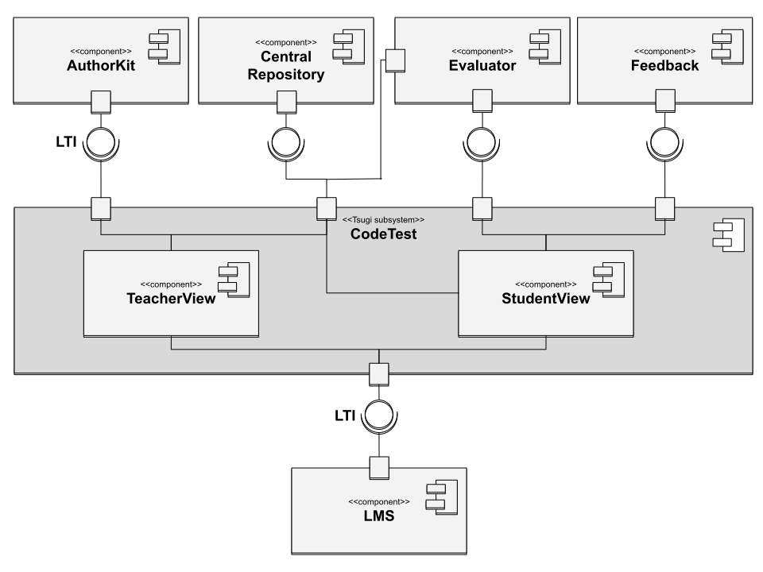

## Architecture of JuezLTI

The goal of JuezLTI is to provide assessment of exercises in a wide range of languages used in computing within the LMS.
To attain this goal JuezLTI relies on a combination of features: 
1. the interoperability with the LMS provided by the TSUGI framework;
2. a modular design allowing the incorporation of evaluators for new domains; 
3. a generic feedback system to help students to overcome their difficulties;
4. a centralized repository of exercises from where they can be exported and imported.

The architecture of JuezLTI is depicted by the UML component diagram in figure above. 
At the center of this architecture is CodeTest, the main component based on TSUGI, the framework that provides LTI support, 
and its sub-components  TeacherView and StudentView. 
The former is a web environment where the teacher configures the activity by adding exercises from a central repository. 
The latter is a web environment where the student attempt to solve the proposed exercises. 

The TSUGI-based component relies on several kinds of components depicted on the top of the diagram in Figure~\ref{fig:structure}. 
From left to right they are Autorkit, Central Repository, Evaluator, and Feedback. 
AuthorKit is an exercise authoring system that can be used by teachers to create exercises for JuezLTI. 
The central repository acts as a pool of exercises for the system. 
The evaluator component runs the code of the students and checks the results. 
Finally, the feedback system provides information about the result of exercise resolution.

JuezLTI is an open-source project distributed under an Apache 2.0 license. 
It can be installed on the servers of any institution and configured to communicate with the institution's Learning Management System. 
It is available on GitHub in two different forms: production and development. 
The former allows the deployment of the entire system (several docker components) on a production server open to the Internet. 
With the latter, anyone can build the platform locally and contribute to JuezLTI development.

## Choice of language
- [English](README.md)
- [Spanish](README_es.md)
- [Portuguese](README_pt.md)
- [Swedish](README_sv.md)
- [Turkish](README_tr.md)
