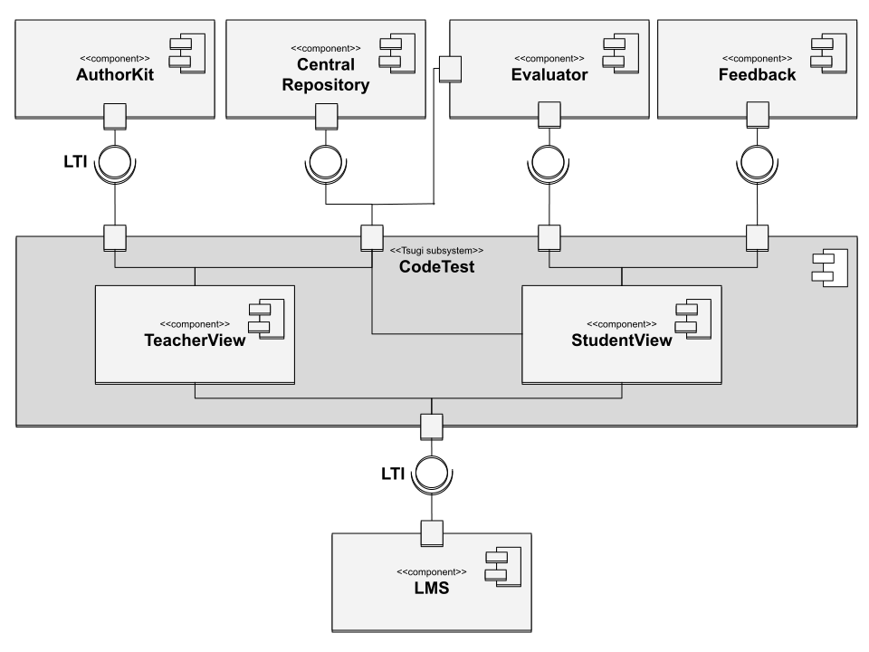

  <a href="README.md">[EN]</a>
  <a href="README_es.md">[ES]</a>
  <a href="README_pt.md">[PT]</a>
  <a href="README_tr.md">[TR]</a>
  <a href="README_sv.md">[SV]</a>

## JuezLTI Tasarımı

JuezLTI ın amacı, LMS – Learning Management System ( Eğitim Yönetim Sistemi) içinde kullanılan çeşitli dillerdeki alıştırmaların değerlendirilmesini sağlamaktır. Bu amaca ulaşmak için JuezLTI aşağıdaki özelliklerin bir kombinasyonunu kullanır: 

1. TSUGI çerçevesi tarafından sağlanan LMS ile birlikte çalışabilirlik;
2. Yeni tip alıştırmalar için doğrulayıcıların dahil edilmesini sağlayan modüler bir tasarım;
3. Öğrencilerin zorlukların üstesinden gelmelerine yardımcı olacak genel bir geri bildirim sistemi;
4. Alıştırmaların içe ve dışa aktarılabileceği merkezi bir depo/havuz.

JuezLTI tasarımı yukarıdaki UML bileşen diyagramı ile gösterilmiştir. Bu tasarımın merkezinde LTI desteği sağlayan TSUGI çerçevesine dayalı ana bileşen olarak **codeTest** bulunur.**Öğretmen Görünümü** ve **Öğrenci Görünümü** de alt bileşenleridir. İlki, öğretmenin merkezi bir havuzdan alıştırmalar ekleyerek etkinlikler yapılandırdığı bir web ortamıdır. İkincisi ise öğrencinin önerilen alıştırmaları çözmeye çalıştığı bir web ortamıdır.

Bu _TSUGI-tabanlı bileşen, diyagramın üst kısmında açıklanan çeşitli bileşen türlerine dayanır.Bunlar soldan saga **Authorkit**, **Merkezi depo/havuz**, **Değerlendirici** ve **Geribildirim** şeklindedir. 

AuthorKit öğretmenler tarafından JuezLTI için alıştırmalar oluşturmada kullanabilecekleri bir alıştırma yazım sistemidir. Merkezi depo system için bir alıştırma havuzu görevin görür.
Değerlendirici, öğrencilerin kodunu çalıştırır ve sonuçları control eder.Son olarak geribildirim sistemi alıştırmanın çözümlenme sonucuyla ilgili bilgileri sağlar.

JuezLTI, Apache 2.0 lisansı altında dağıtılan açık kaynaklı bir projedir. Herhangi bir kurumun sunucularına kurulabilir ve kurumun LMS si ile iletişim kuracak şekilde yapılandırılabilir.
      
Üretim ve geliştirme olmak üzere GitHub da iki farklı biçimde bulunur. İlki, internetten erişilebilen bir üretim sunucusunda çeşitli docker bileşenleriyle tüm sistemin geliştirilmesine izin verir. Diğeri ile de herkes platformu yerel olarak oluşturabilir ve JuezLTI’ın gelişimine katkıda bulunabilir. 
