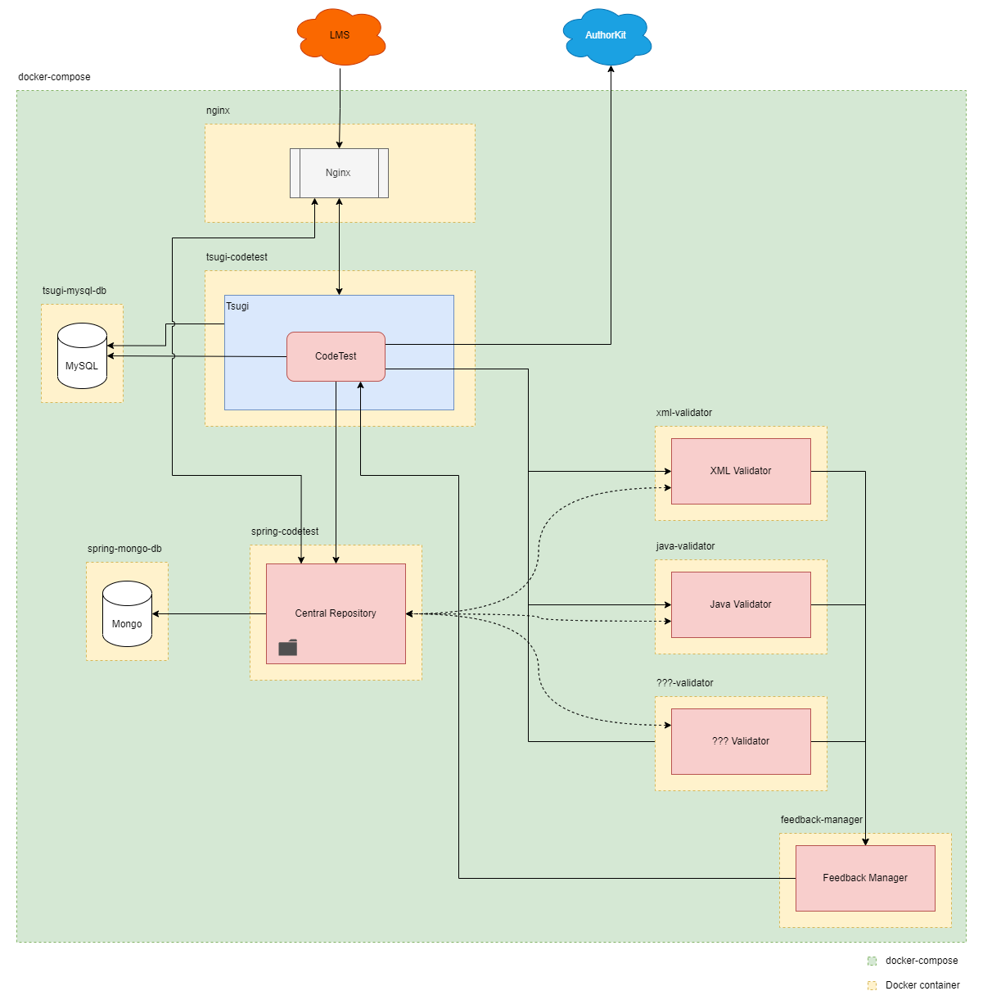
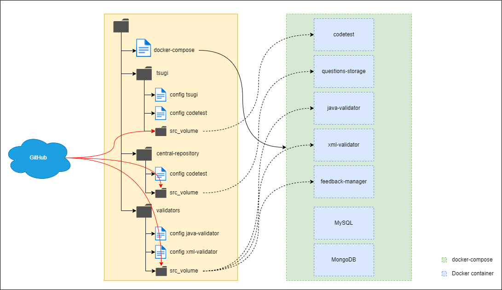

# JuezLTI architecture
JuezLTI se compone de diferentes módulos interconectados, cada uno de ellos con un fin muy concreto. En la siguiente imagen podemos ver los diferentes elementos que lo conforman.

 

Imagen 1

 

- Nginx (Frontal/Proxy): Es el punto de entrada/salida de nuestro sistema. Nos permite independizar la red interna del exterior. Expone solo los puertos y contextos deseados, por lo que facilita la gestión de la seguridad de todo el entorno. También se encarga de gestionar las conexiones HTTPS.

- Tsugi + Codetest (Frontal Web): Es la cara visible de nuestro sistema. Permite tanto a profesores como alumnos interactuar con los ejercicios/preguntas. En la práctica, Codetest (la esencia del frontal web) es un módulo dentro de Tsugi, que nos facilita toda la gestión del estándar LTI.

- BD MySQL: Base de datos donde se almacenará todo lo relacionado a Tsugi y Codetest.
Central Repository (Repositorio + API): Aquí se almacenan todos los ejercicios de forma centralizada y global. Este componente suministra datos al frontal web, al sistema de validación (ver más adelante) y expone una API Rest que permite ser consultada externamente.

- BD Mongo: Base de datos con información relativa a los ejercicios y su uso.
Validadores (Java, XML, SQL…): Conjunto dinámico e indefinido de componentes dedicados a la validación de los ejercicios. Básicamente, para un ejercicio y la respuesta de un usuario a dicho ejercicio, nos dirá si es correcta o incorrecta.
Feedback Manager (Normalizador de respuestas): Se encarga de devolver una respuesta normalizada al frontal web.

 

Por otro lado, nuestro sistema necesita/hace uso de otros dos elementos externos:

- AuthorKit (Generación/Gestión de Ejercicios): Antes de que JuezLTI fuera autosuficiente en la creación y gestión de ejercicios, se utilizaba AuthorKit como plataforma externa proveedora de los mismos. Ahora mismo, aunque ya no resulta imprescindible, sigue siendo una opción válida.

- LMS (Moodle, Sakai, Canvas, Blackboard…): Puesto que JuezLTI está pensada como una herramienta LTI, es necesario de un LMS que que la importe y haga uso de ella.

  

# Repositorios Online
¿Dónde está el código fuente?¿Cómo se organiza?
Todo el código fuente de JuezLTI se encuentra en [GitHub](https://github.com/JuezLTI)

#### GitHub es una plataforma online que ofrece la posibilidad de almacenar y gestionar repositorios y control de versiones de proyectos software. Estos repositorios pueden ser de ámbito privado o expuestos públicamente.

En nuestro caso, puesto que estamos trabajando en un proyecto OpenSource (colaborativo y público), la elección de GitHub es trivial. No solo nos permite compartir y delimitar los distintos cambios y mejoras entre los diferentes participantes del proyecto, sino que también nos da la posibilidad de gestionar diferentes ramas o versiones del proyecto según necesidades.

Tal y como veíamos antes, JuezLTI está compuesto por diferentes elementos. Cada uno de estos elementos tiene su propio repositorio en GitHub:

- [Tsugi](https://github.com/JuezLTI/tsugi)

- [Codetest](https://github.com/JuezLTI/codetest)

- [Central Repository](https://github.com/JuezLTI/questions-storage)

- [Feedback Manager](https://github.com/JuezLTI/feedback-manager)

 

### Validadores:
######  - [Java Evaluator](https://github.com/JuezLTI/java-evaluator)
######  - [XML Evaluator](https://github.com/JuezLTI/xml-evaluator)
######  - [SQL Evaluator](https://github.com/JuezLTI/sql-evaluator)

 

Además, existe un repositorio adicional y que resulta de especial importancia.
Se trata del [<strong>deploy_docker</strong>](https://github.com/JuezLTI/deploy_docker).
Este repositorio contiene todo lo necesario para desplegar y hacer funcionar toda la plataforma JuezLTI de manera automática gracias a la tecnología Docker

 

# Módulos desplegables con Docker

Docker es un sistema open source destinado a gestionar contenedores de aplicaciones. Cada contenedor puede virtualizar un entorno y sistema operativo completamente diferente e independiente, ofreciendo lo que viene a llamarse un SandBox.

Este sistema de contenedores facilita en gran medida su despliegue y modularización en cualquier plataforma.
Gracias a esta tecnología vamos a encapsular cada uno de los componentes del proyecto en un contenedor independiente, todos ellos interconectados dentro de la misma red/proyecto del compositor de Docker.

Si recordamos la estructura original de JuezLTI (imagen 1), ahora podemos ver como queda tras configurarla con Docker:

 

Imagen 2

 
 

## Full deployment

Si nos descargamos la rama “deployment” del repositorio “[<strong>deploy_docker</strong>](https://github.com/JuezLTI/deploy_docker)” en nuestro equipo dispondremos de la siguiente estructura de directorios (resaltado en amarillo):

 

Imagen 3

 

Destacar aquí el fichero “docker-compose”, que contiene la configuración necesaria para hacer funcionar todos y cada uno de los componentes que forman nuestro sistema.

Para arrancar el entorno Docker y todos los componentes que lo conforman, basta con ejecutar el comando “docker-compose up” desde la raíz del proyecto.

Docker hará uso de los distintos ficheros de configuración organizados por carpetas para configurar cada contenedor/componente. Al arrancar un contenedor Docker, se descargará automáticamente su código fuente desde su repositorio en GitHub, lo compilará, configurará y arrancará. 

 

## Modular deployment

Por otro lado, también es posible separar los componentes e ir montandolos por separado. En este caso se deberá configurar los puertos y direcciones a las que apuntan los distintos componentes para poder comunicarse entre sí.

El único componente que no debería desplegarse es el <strong>repositorio central</strong>, pues su propia naturaleza indica que debe ser único y conocido globalmente

  
  
## Development deployment
  

imagen 4

 
 
Para el entorno de pruebas, en GitHub disponemos de la rama “master” del repositorio “deploy_docker”. Si optamos por descargarnos esta rama obtendremos un directorio similar al que veíamos anteriormente con el  full deployment. La diferencia en este caso radica en que tendremos el código fuente de cada componente en local.
 
Para descargarse el código fuente basta con el ejecutar el script “clone-repos” incluido en la raíz del proyecto.

Para arrancar el sistema, lo haremos igual que antes mediante el comando “deploy-docker up”. En este caso Docker no descargará nada, simplemente montará los contenedores usando el código de los directorios disponibles en nuestro proyecto local.
Esto nos permite hacer modificaciones y personalizaciones de forma mucho más sencilla.
  
 
  
# SETUP OF THE WORKING ENVIRONMENT
  
   
  
### DEPLOYMENT
  
Como hemos mencionado anteriormente, el proyecto cuenta con un fichero docker-compose con todo lo necesario para ejecutar una instancia de JuezLTI funcional. Por supuesto es requisito fundamental tener tener instalado tanto Docker, como docker-compose en el sistema.

 
  
Cada componente que forma JuezLTI dispone de sus propios requisitos:

 
- [ Apache 2.4.46 ] - [ PHP 7.3.21 ] Para la instalación de Tsugi - Codetest
  
- [ Java 8 ] - [ MongoDB ] Para la instalación/uso de repositorio de preguntas ( questions - storage , SpringBoot )
  
- [ MySQL 5.7 ] Usado por Tsugi - Codetest
  
- [ Node.js 16.13.2 ] Usado por los validadores y feedback-manager

 
  
Antes de nada, es necesario copiar el archivo `.env.example` y renombrarlo como `.env`. Dentro de este fichero podremos configurar las distintas variables/tokens necesarias para acceder a los repositorios GitHub, así como configurar los distintos puntos de acceso (dominio, puerto, usuario, contraseña) de cada uno de los componentes.
  
Una vez configurado el fichero `.env` si lanzamos el comando `docker-compose up`, se inicializará todo el proceso de despliegue Docker. Con esto, ya tendremos una instancia funcional de JuezLTI. 
  
Si necesitamos actualizar/reiniciar de forma específica uno de los componentes, podemos hacerlo mediante el comando `docker-compose build --no-cache --force-rm <service-name>` de esta manera volveremos a construir el contenedor Docker pero con la nueva información de GitHub.
Para recompilar y reiniciar todo el sistema con la última versión disponible en los repositorios de GitHub, se dispone del script “deploy.sh” en el directorio raíz.

 
  
### DEVELOPMENT:
  
Está formado por los mismos elementos que el entorno de despliegue y por tanto también necesita copiar y configurar las variables/token del fichero `env.example`.

En el directorio raíz encontraremos un script llamado clone-repos (Windows: `clone-repos.bat`, Linux: `clone-repos-sh`), que nos clonara todos los repositorios necesarios para JuezLTI en nuestro directorio local.
  
Para poder acceder por HTTPS a nuestro sistema local y que todo sea lo más parecido posible al entorno real, necesitaremos crear un certificado SSL autofirmado. Todo esto está explicado en detalle en [generate_certs.md](https://github.com/JuezLTI/deploy_docker/blob/master/generate_certs.md).
  
   
  
El certificado generado  ( [ "yourkey”.key ] - [ “yourKeyCert”.crt ]) debe copiarse dentro del directorio local `./nginx/certs`. Después de eso, será necesario editar el fichero ./nginx/default.conf.template y modificar los siguiente parámetros:
  
- `ssl_certificate_key` -> `ssl_certificate_key /opt/certs/(yourKey).key`;
  
- `ssl_certificate` -> `ssl_certificate /opt/certs/(yourKeyCrt).crt`;

Después de esto, podemos arrancar el sistema igual que siempre usando el comando `deploy-docker up`.
  
 
 
#### Utilidades:
  
- Existen diferentes scripts (de momento solo para Windows) que nos permiten recompilar y reiniciar los distintos componentes individualmente. Se llaman compile_XXX.bat. Obviamente, compile_all.bat lo hace para todos los componentes.
  
- Si ejecutamos el comando `docker-compose up -d` nos montará el entorno docker pero mostrando por consola todos los detalles de los contenedores para ver así cualquier complicación en el proceso.

- Para reiniciar un contenedor se puede usar el comando `docker-compose build --no-cache --force-rm <service-name>`
  
- Para el debug del repositorio-central (SpringBoot) podemos usar un debugger remoto que acceda al contenedor docker de SpringBoot y así ver posibles errores o trazas que pongamos en el código.
