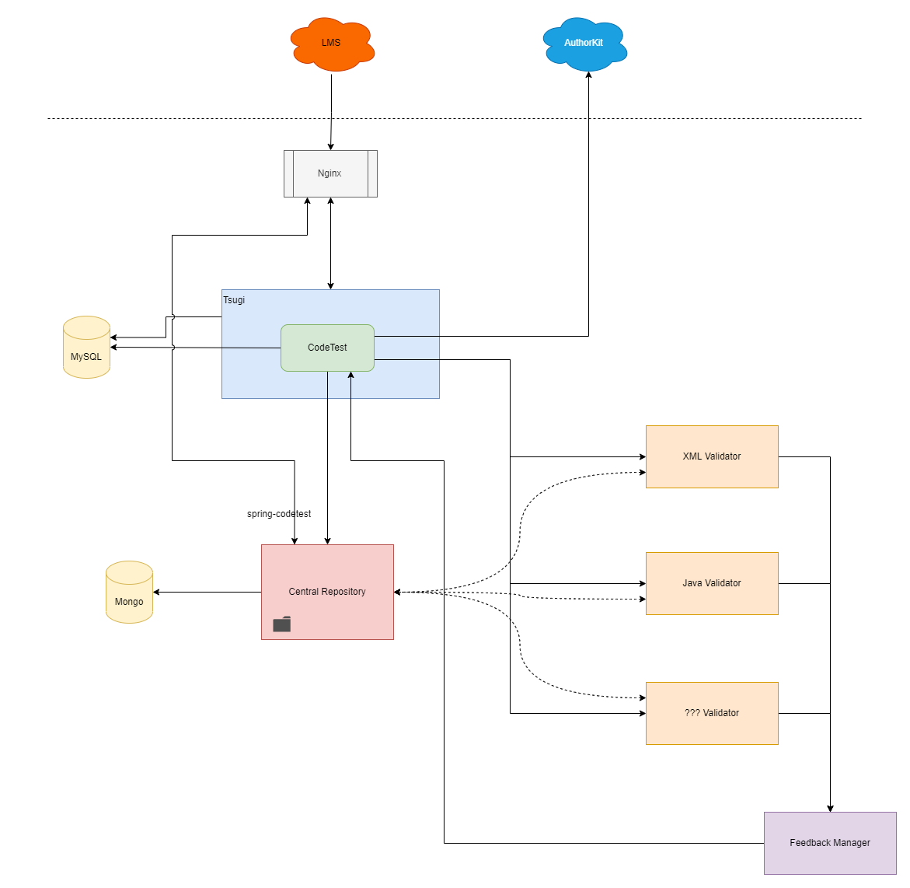
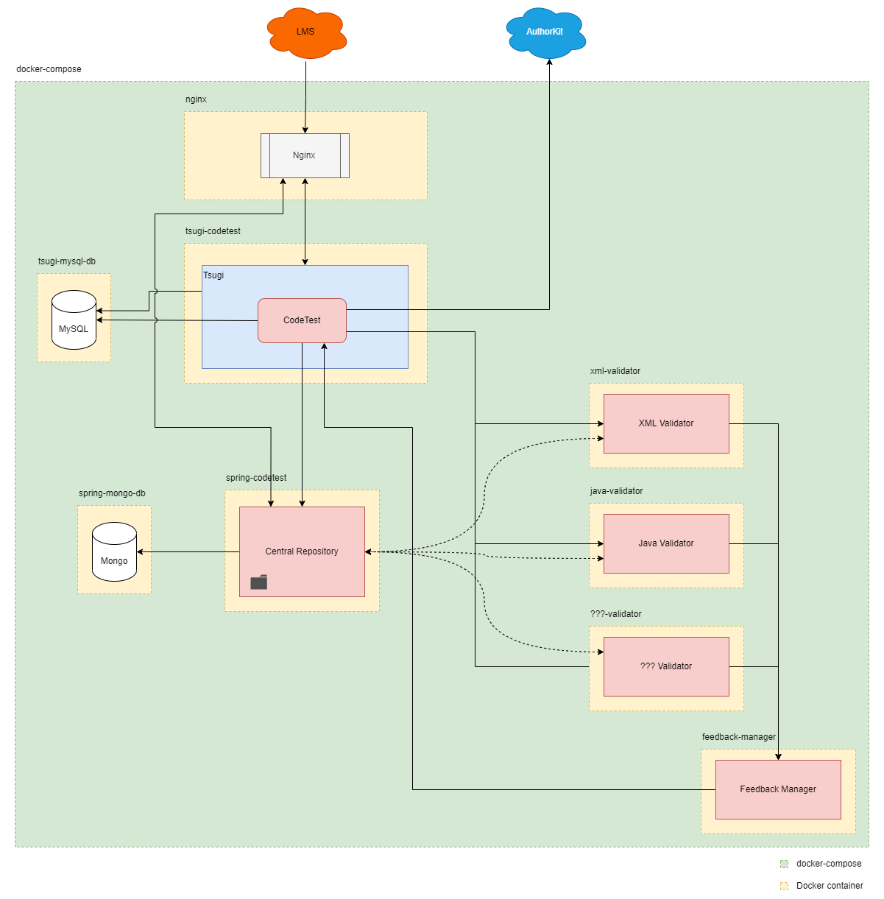
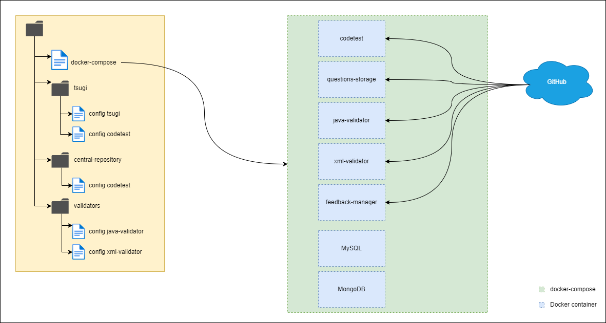
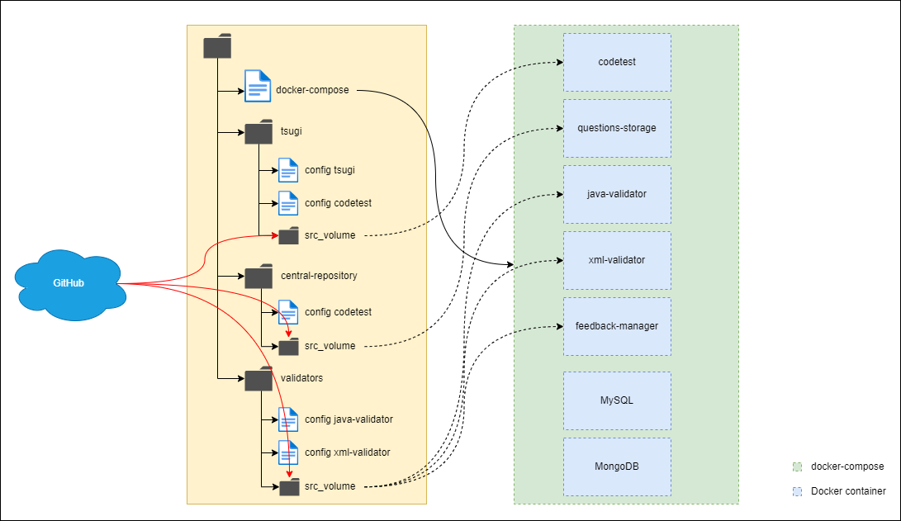

  <a href="../en/README.md">[EN]</a>
  <a href="../es/README.md">[ES]</a>
  <a href="../pt/README.md">[PT]</a>
  <a href="../tr/README.md">[TR]</a>
  <a href="../sv/README.md">[SV]</a>

# Arquitetura JuezLTI
JuezLTI é composto por diferentes módulos interligados, cada um deles com um objectivo específico. Na imagem seguinte podemos ver os diferentes elementos que o compõem.

 

Imagem 1

 

- Nginx (Frontal/Proxy): É o ponto de entrada/saída do nosso sistema. Permite tornar a rede interna independente da exterior. Expõe apenas as portas e contextos desejados, tornando mais fácil a gestão da segurança de todo o ambiente. É também responsável pela gestão das ligações HTTPS.

- Tsugi + Codetest (Web Frontal): A face visível do nosso sistema. Permite tanto aos professores como aos alunos interagir com os exercícios/questões. O Codetest (a essência do front-end da Web) é um módulo dentro do Tsugi, que facilita toda a gestão do _standard_ LTI.

- BD MySQL: Base de dados onde será armazenado tudo relacionado com o Tsugi e Codetest.
Repositório Central (Repositório + API): Aqui são armazenados todos os exercícios de forma central e global. Este componente fornece dados para o front-end da web, para o sistema de validação (ver abaixo) e expõe uma API de Repositório que pode ser consultada externamente.

- BD Mongo: Base de dados com informações relacionadas aos exercícios e a sua utilização.
Validadores (Java, XML, SQL...): Conjunto dinâmico e indefinido de componentes dedicados à validação dos exercícios. Basicamente, para um exercício e umaa resposta de um utilizador a esse exercício, devolverá se está correcto ou incorrecto.
Gestor de Feedback (Normalizador de Resposta): Devolve uma resposta normalizada ao front-end da web.

 

O nosso sistema precisa/faz uso de dois outros elementos externos:

- AuthorKit (Criação/Gestão de Exercícios): Antes do JuezLTI ser auto-suficiente na criação e gestão de exercícios, era utilizado o _AuthorKit_ como uma plataforma fornecedora externa de exercícios. Hoje em dia, já não é necessário mas continua a ser uma opção válida.

- LMS (Moodle, Sakai, Canvas, Blackboard…): Uma vez que JuezLTI se destina a ser uma ferramenta LTI, é necessário um LMS para a importar e usar.

  

# Repositórios Online
Onde está o código fonte e como está organizado?
Todo o código fonte para o JuezLTI pode ser encontrado em [GitHub](https://github.com/JuezLTI)

#### GitHub é uma plataforma online que oferece a possibilidade de armazenar e gerir repositórios e controlo de versões de projectos de software. Estes repositórios podem ser privados ou públicos.

No nosso caso, uma vez que estamos a trabalhar num projecto OpenSource (colaborativo e público), a escolha de GitHub é trivial. Não só nos permite partilhar e delimitar as diferentes mudanças e melhorias entre os diferentes participantes do projecto, como também nos dá a possibilidade de gerir diferentes ramos ou versões do projecto, conforme necessário.

Como vimos anteriormente, JuezLTI é composto por diferentes elementos. Cada um destes elementos tem o seu próprio repositório no GitHub:

- [Tsugi](https://github.com/JuezLTI/tsugi)

- [Codetest](https://github.com/JuezLTI/codetest)

- [Central Repository](https://github.com/JuezLTI/questions-storage)

- [Feedback Manager](https://github.com/JuezLTI/feedback-manager)

 

### Validadores:
######  - [Avaliador Java](https://github.com/JuezLTI/java-evaluator)
######  - [Avaliador XML](https://github.com/JuezLTI/xml-evaluator)
######  - [Avaliador SQL](https://github.com/JuezLTI/sql-evaluator)

 

Existe também um repositório adicional de particular importância.
O seu nome é [<strong>deploy_docker</strong>](https://github.com/JuezLTI/deploy_docker).
Este repositório contém tudo o que é necessário para implementar e executar automaticamente toda a plataforma JuezLTI, graças à tecnologia Docker.

 

# Módulos implementáveis com Docker

O Docker é um sistema de código aberto para a gestão de _containers_ de aplicações. Cada contentor pode virtualizar um ambiente e sistema operacional completamente diferentes e independentes, oferecendo uma SandBox.

Este sistema de _containers_ facilita imenso a sua implementação e modularização em qualquer plataforma.
Graças a esta tecnologia, encapsularemos cada um dos componentes do projecto num _container_ independente, todos eles interligados dentro da mesma rede/projecto do Docker _composer_.

Tendo em conta a estrutura original do JuezLTI (imagem 1), podemos ver como fica depois de configurada com Docker:

 

Imagem 2

 
 

## Implementação completa

if you download the "deployment" branch from the repository “[<strong>deploy_docker</strong>](https://github.com/JuezLTI/deploy_docker)” in our computer we will have the following directory structure (highlighted in yellow):
Se se descarregar a _branch "deployment"_ do repositório "[<strong>deploy_docker</strong>](https://github.com/JuezLTI/deploy_docker)", teremos a seguinte estrutura de directório (destacado em amarelo):

 

Imagem 3

 

O ficheiro "docker-compose" contém a configuração necessária para executar cada um dos componentes que compõem o sistema.

Para iniciar o ambiente Docker e todos os seus componentes, basta executar o comando "docker-compose up" a partir da raiz do projecto.

O Docker fará uso dos diferentes ficheiros de configuração organizados por pastas para configurar cada _container_/componente. Quando se inicia um _container_ Docker, este descarregará automaticamente o seu código fonte a partir do seu repositório GitHub, compilando-o, configurando-o e executando-o.

 

## Implementação modular

Por outro lado, é possível separar os componentes e configurá-los separadamente. Neste caso, as portas e endereços dos diferentes componentes devem ser configurados manualmente, a fim de comunicar com os outros componentes.

O único componente que não deve ser implantado é o <strong>central repository</strong>. Este deve ser único e globalmente conhecido.

  
  
## Implementação de desenvolvimento
  

Imagem 4

 
 
Para o ambiente de teste, temos a _branch_ "master" do repositório "deploy_docker" no GitHub. Se descarregarmos esta _branch_, obteremos um directório semelhante ao que vimos anteriormente com o deploy_docker completo. Neste caso, a diferença é que teremos o código fonte de cada componente localmente.
 
Para descarregar o código fonte basta executar o script "clone-repos" incluído na raiz do projecto.

Para executar o projecto, faremos o mesmo que antes, utilizando o comando "deploy-docker up". Neste caso, o Docker não irá descarregar nada, irá simplesmente montar os _containers_ utilizando o código dos directórios disponíveis no nosso projecto local.
Isto permite-nos fazer modificações e personalizações de uma forma muito mais fácil.
  
 
  
# CONFIGURAÇÃO DO AMBIENTE DE TRABALHO
  
   
  
### IMPLEMENTAÇÃO
  
Como mencionado acima, o projecto tem um ficheiro de composição de doca com tudo o que é necessário para executar uma instância funcional de JuezLTI. Claro que é um requisito fundamental ter tanto o Docker como o docker-compose instalados no sistema.

 
  
Cada componente que compõe o JuezLTI tem os seus próprios requisitos:

 
- [ Apache 2.4.46 ] - [ PHP 7.3.21 ] Para a instalação de Tsugi - Codetest
  
- [ Java 8 ] - [ MongoDB ] Para instalação/utilização do repositório de perguntas ( perguntas - armazenamento , SpringBoot )
  
- [ MySQL 5.7 ] Utilizado pelo Tsugi - Codetest
  
- [ Node.js 16.13.2 ] Utilizado por validadores e gestores de feedback

 
  
Inicialmente é necessário copiar o ficheiro ".env.example" e renomeá-lo como ".env". Dentro deste ficheiro podemos configurar as diferentes variáveis/tokens necessárias para aceder aos repositórios GitHub e para configurar os diferentes pontos de acesso (domínio, porta, utilizador, palavra-passe) para cada um dos componentes.
  
Uma vez configurado o ficheiro ".env", se lançarmos o comando "docker-compose up", todo o processo de lançamento do Docker será inicializado. Uma vez terminado o processo, teremos uma instância funcional do JuezLTI. 
  
Se precisarmos de actualizar/reiniciar especificamente um dos componentes, podemos fazê-lo utilizando o comando "docker-compose build --no-cache --force-rm <service-name>". Utilizando este comando, reconstruiremos o _container_ Docker com as novas informações de GitHub.
Para recompilar e reiniciar todo o sistema com a última versão disponível nos repositórios GitHub, podemos usar o script "deploy.sh" que está disponível no directório raiz.

 
  
### DESENVOLVIMENTO:
  
Consiste nos mesmos elementos que o ambiente de implementação e, portanto, também precisa de copiar e configurar as variáveis/token do ficheiro "env.example".

No directório raiz encontraremos um script chamado "clone-repos.bat" (Windows: clone-repos.bat, Linux: clone-repos-sh), que clonará todos os repositórios necessários para JuezLTI no nosso directório local.
  
Para podermos aceder ao nosso sistema local através de HTTPS, teremos de criar um certificado SSL auto-assinado. Explicado em detalhe em [generate_certs.md](https://github.com/JuezLTI/deploy_docker/blob/master/generate_certs.md).
  
   
  
O certificado gerado ( [ "yourkey".key ] - [ "yourKeyCert".crt ]) deve ser copiado para o directório local ./nginx/certs. Depois disso, será necessário editar o ficheiro ./nginx/default.conf.template e modificar os seguintes parâmetros:
  
- ‘ssl_certificate_key’ -> ssl_certificate_key /opt/certs/(yourKey).key;
  
- ‘ssl_certificate’ -> ssl_certificate /opt/certs/(yourKeyCrt).crt;

Depois disto, podemos arrancar o sistema como habitualmente usando o comando "deploy-docker up".
  
 
 
#### Utilidades:
  
- Existem diferentes scripts (de momento apenas para Windows) que nos permitem recompilar e reiniciar os diferentes componentes individualmente. São chamados compile_XXX.bat. Como seria de esperar, compile_all.bat fá-lo para todos os componentes.
  
- Se executarmos o comando "docker-compose up -d" será montado o ambiente Docker e mostrará na consola todos os detalhes dos _containers_ para ver qualquer conflito no processo.

- Para reiniciar um _container_ pode usar o comando "docker-compose build --no-cache --force-rm <service-name>".
  
- Para fazer _debug_ do repositório central (SpringBoot) podemos utilizar um _debugger_ remoto que acede ao _container_ SpringBoot do Docker para detetar possíveis erros ou vestígios que colocamos no código.
